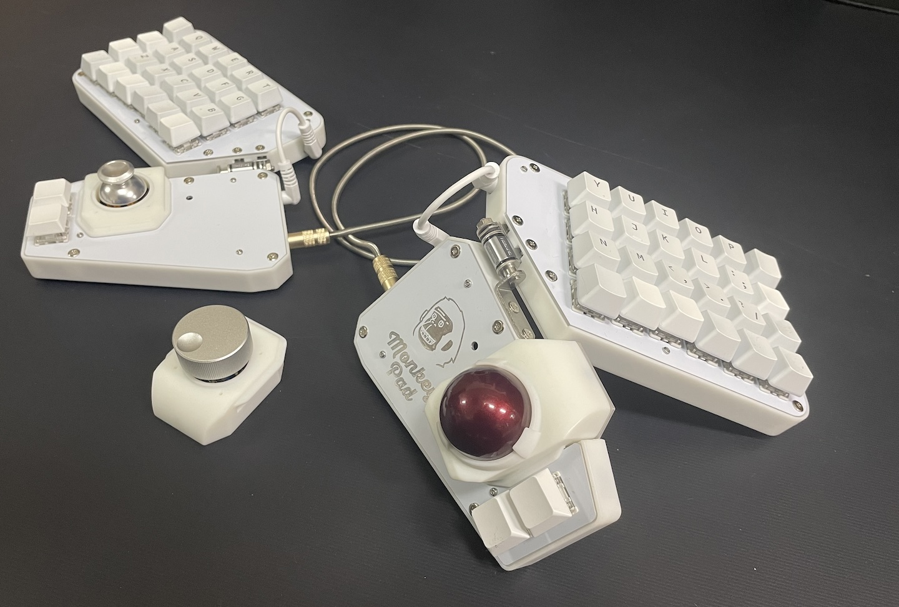

# Monkeypad

Monkeypad is a customizable mechanical keyboard designed for enthusiasts seeking a personalized typing experience. This repository contains the QMK firmware for Monkeypad, a split keyboard featuring a detachable modular trackball, analog joystick, and encoder. It has a tenting structure and can be angled to fit your hand.

## Where to Buy

TBD

## Build Guide

*   Monkeypad(4x6):
    [日本語/Japanese](./build_guide/standard/Japanese/01_ビルドガイド.md)

    English version is being prepared.

## Firmware

See [document for firmware source code](./qmk_firmware/keyboards/monkeypad/monkeypad/4x6/readme.md).

### Pre-compiled Firmwares

The file name means the following:

{No}_{keyboard}_{model}_{left_module}_{right_module}_{LEFT HAND or RIGH HAND}_{keymap}.uf2

For the following combinations, flash the same firmware for both sides.

|No.|LEFT|RIGHT| *.uf2 |
|:----|:----|:----|:----|
|1|Trackball|Trackball|[1_mp_mk1_trackball_via.uf2](https://github.com/monkeypad/monkeypad/releases/download/v0.1.0/1_mp_mk1_trackball_via.uf2)|
|2|Analog Joystick|Analog Joystick|[2_mp_mk1_joystick_via.uf2](https://github.com/monkeypad/monkeypad/releases/download/v0.1.0/2_mp_mk1_joystick_via.uf2)|
|3|Encoder|Encoder|[3_mp_mk1_encoder_via.uf2](https://github.com/monkeypad/monkeypad/releases/download/v0.1.0/3_mp_mk1_encoder_via.uf2)|
|4|Encoder|Trackball|[4_mp_mk1_left_encoder_right_trackball_via.uf2](https://github.com/monkeypad/monkeypad/releases/download/v0.1.0/4_mp_mk1_left_encoder_right_trackball_via.uf2)|
|5|Encoder|Analog Joystick|[5_mp_mk1_left_encoder_right_joystick_via.uf2](https://github.com/monkeypad/monkeypad/releases/download/v0.1.0/5_mp_mk1_left_encoder_right_joystick_via.uf2)|
|6|Trackball|Encoder|[6_mp_mk1_left_trackball_right_encoder_via.uf2](https://github.com/monkeypad/monkeypad/releases/download/v0.1.0/6_mp_mk1_left_trackball_right_encoder_via.uf2)|
|7|Analog Joystick|Encoder|[7_mp_mk1_left_joystick_right_encoder_via.uf2](https://github.com/monkeypad/monkeypad/releases/download/v0.1.0/7_mp_mk1_left_joystick_right_encoder_via.uf2)|

For the following combinations, flash different firmware for each of the left and right sides.

|No.|LEFT|RIGHT|left *.uf2|right *.uf2|
|:----|:----|:----|:----|:----|
|8|Analog Joystick|Trackball|[8_mp_mk1_left_joystick_right_trackball_LEFT_via.uf2](https://github.com/monkeypad/monkeypad/releases/download/v0.1.0/8_mp_mk1_left_joystick_right_trackball_LEFT_via.uf2)|[8_mp_mk1_left_joystick_right_trackball_RIGHT_via.uf2](https://github.com/monkeypad/monkeypad/releases/download/v0.1.0/8_mp_mk1_left_joystick_right_trackball_RIGHT_via.uf2)|
|9|Trackball|Analog Joystick|[9_mp_mk1_left_trackball_right_joystick_LEFT_via.uf2](https://github.com/monkeypad/monkeypad/releases/download/v0.1.0/9_mp_mk1_left_trackball_right_joystick_LEFT_via.uf2)|[9_mp_mk1_left_trackball_right_joystick_RIGHT_via.uf2](https://github.com/monkeypad/monkeypad/releases/download/v0.1.0/9_mp_mk1_left_trackball_right_joystick_RIGHT_via.uf2)|

(TO BE DOCUMENTED)
