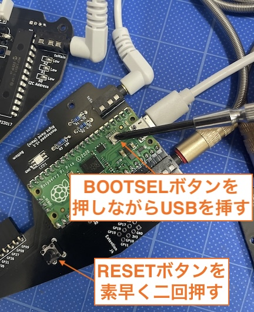

### Monkeypad Build Guide Top Page is here [English](01_build_guide.md)）

  - [9. 予備テスト](09_予備テスト.md)

作業の後戻りを少なくするためにも、予備テストのステップを行うことをお勧めします。

## 9-1.テスト用ファームウェアを書き込む

以下のテスト用ファームウェア`monkeypad_test.uf2`をダウンロードし、左右のRaspberry Pi Picoに書き込みます。

[Download monkeypad_test.uf2](./firmware/0_mp_mk1_test.uf2)

以下の写真のようにメインボード、サブボードをTRRSケーブルで接続し、Raspberry Pi PicoにUSBケーブルを接続します。

Raspberry Pi Picoは、PCB上に取り付けたResetボタン（タクトスイッチ）を素早く2回押すと、DFUモードで起動し、プログラムが書き込み可能となります。
PC上でRPI-RP2というUSBメモリのようなドライブとして認識されます。

（または、Pico上のBOOTSELボタンを押しながらUSBケーブルでPCと接続しても同様です。）

<!--  -->

ダウンロードしたファイルをそこにドラッグ&ドロップしてドライブが自動的に消えたら成功です。 

(20)メイン間TRRSケーブル(21)メイン、サブボード間TRRSケーブルを写真のように接続します。PCとメインボードのUSBケーブルは一本のみにしてください。

左右どちらを接続しても構いません。

## 9-2.テスト

書き込みが終わったら、LEDが点灯するか。
導通する金属製のピンセットなどを当てて、キーボードのテストサイトなどを利用してすべてのキーが反応するか確認します。

反応しない場合は、ダイオードの向きやスイッチソケットが適切にはんだ付けされているか、TRRSケーブルが奥まで挿さっているかを確認してください。

初めてのキーボード製作であれば、一発でうまく動かかないということもあると思います。
Q&Aを見ながらトラブルシュートしていきましょう。

すべてのキーが反応するようになったら、いよいよ組み立てです。  

  - [次へ(10_ノーマルのキースイッチの組み立て)](10_組み立て.md)

  - [次へ(サブボードをロープロファイルに変更される場合はこちら)](low_profile/10_組み立て_ロープロ.md)
