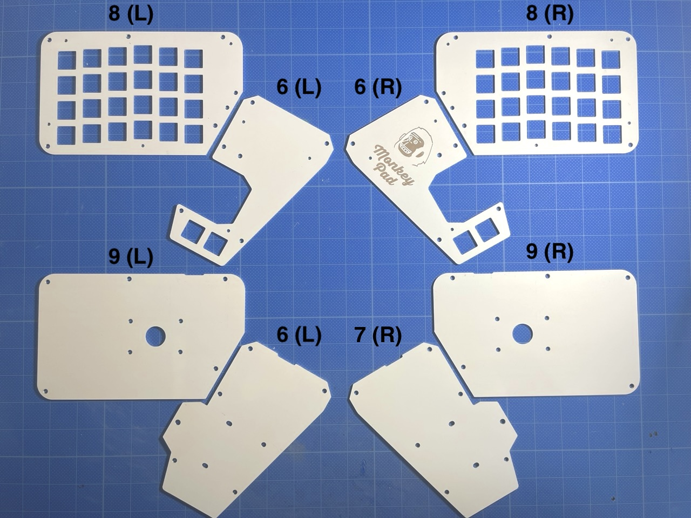
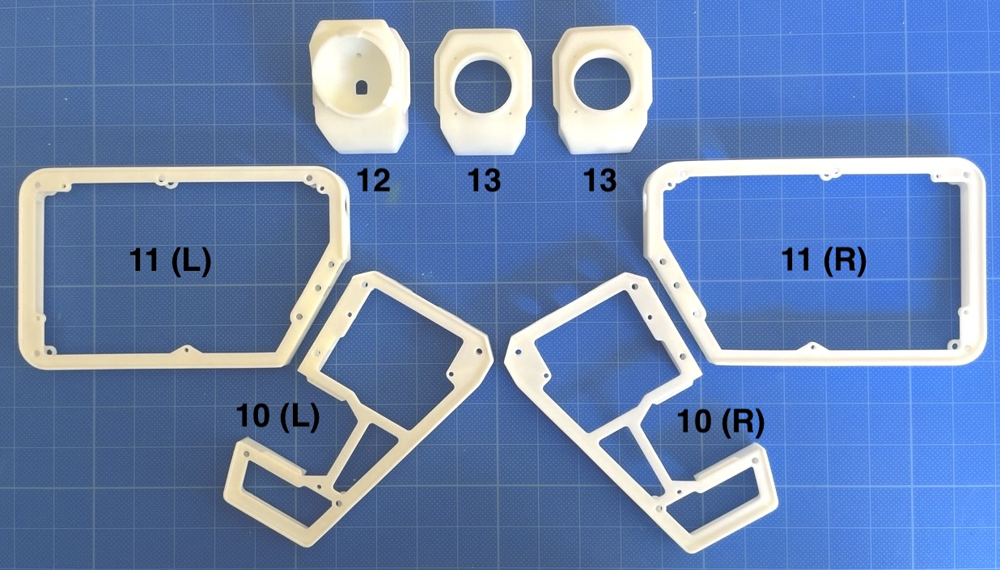
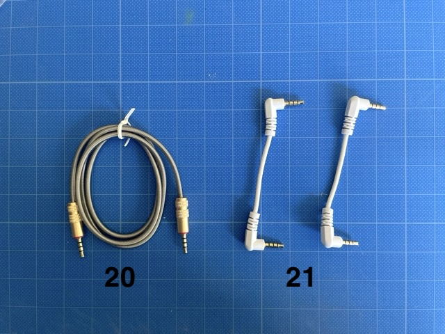
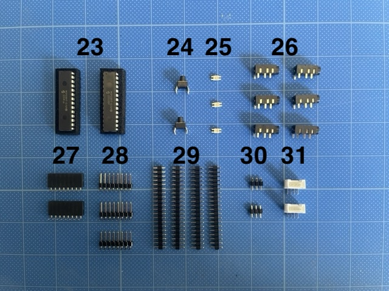
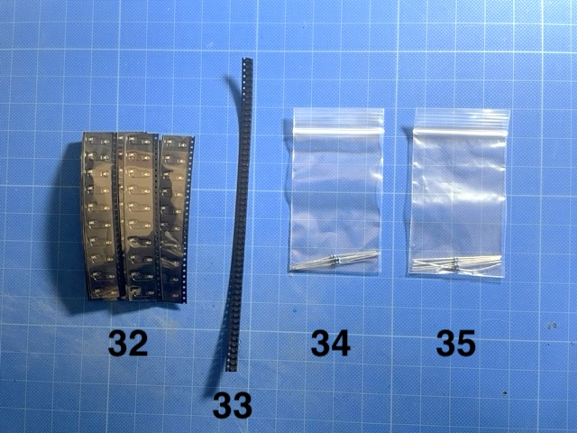
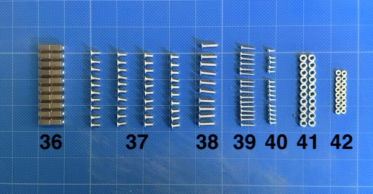
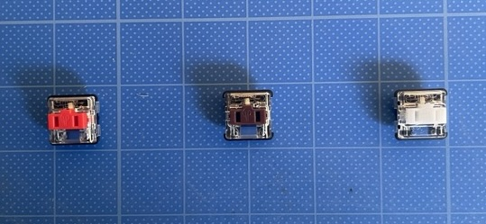
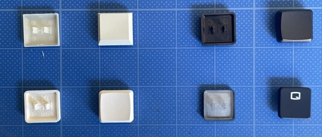

### Monkeypad Build Guide Top Page is here [English](01_build_guide.md)
<!-- English build guide is [here](https://github.com/xxxxxx.md).
   -->

標準仕様

ロープロファイル仕様 (標準仕様を組み立て後に部品追加で変更できます)

  - [1. 作業の前に](01部品確認)
    - [1-1. キット同梱品](#1-1キット同梱品)
    - [1-2. 組立前にお客様自身で準備いただく部品](#1-2組立前にお客様自身で準備いただく部品)
    - [1-3. オプション](#1-3オプション)
    - [1-4. 別売り　追加モジュール](#1-4追加モジュール(別売))
  - [2. 準備](02_準備.md)
    - [2-1. 必要な工具](./02_準備.md/#2-1必要な工具)
  - [3. はんだ付け](03_はんだ付け.md)
    - [3-1. はんだ付けの前に](./03_はんだ付け.md/#3-1はんだ付けの前に)
    - [3-2. ダイオードの取り付け](./03_はんだ付け.md/#3-2ダイオードの取り付け)
    - [3-3. 抵抗の取り付け](./03_はんだ付け.md/#3-3抵抗の取り付け)
    - [3-4. キーソケットの取り付け](./03_はんだ付け.md/#3-4キーソケットのはんだ付け)
  - [4. ジョイスティックの組み立て](04_ジョイスティック.md)  
    - [4-1. 使用する部品](./04_ジョイスティック.md/#4-1使用する部品)
    - [4-2. ジョイスティックモジュールの組み立て](./04_ジョイスティック.md/#4-2ジョイスティックモジュールの組み立て)
    - [4-3. ジョイスティックの取り付け](./04_ジョイスティック.md/#4-3ジョイスティックの取り付け)
  - [5. エンコーダの組み立て](05_エンコーダ.md)
    - [5-1. 使用する部品](./05_エンコーダ.md/#5-1使用する部品)
    - [5-2. エンコーダ部品のはんだ付け](./05_エンコーダ.md/#5-2エンコーダ部品のはんだ付け)
    - [5-3. エンコーダモジュールの組み立て](./05_エンコーダ.md/#5-3エンコーダモジュールの組み立て)
  - [6. PMW3360の組み立て](06_PMW3360.md)
    - [6-1. 使用する部品](./06_PMW3360.md/#6-1使用する部品)
    - [6-2. PMW3360部品のはんだ付け](/.06_PMW3360.md/#6-2MW3360部品のはんだ付け)
    - [6-3. トラックボールモジュールの組み立て](./06_PMW3360.md/#6-3トラックボールモジュールの組み立て)  
  - [7. サブボードの組み立て（左/右）](07_サブボード.md)
    - [7-1. 使用する部品](./07_サブボード.md/#7-1使用する部品)
    - [7-2. サブボードの部品のはんだ付け）](./07_サブボード.md/#7-2サブボードの部品のはんだ付け)
  - [8. メインボードの組み立て（左/右）](08_メインボード.md)
    - [8-1. 使用する部品](./08_メインボード.md/#8-1使用する部品)
    - [8-2. メインボードの部品のはんだ付け）](./08_メインボード.md/#8-2メインボードの部品のはんだ付け)
  - [9. 予備テスト](09_予備テスト.md)
  - [10. 組み立て](10_組み立て.md)
    - [10-1. サブボードの組み立て）](./10_組み立て.md/#10-1サブボードの組み立て)
    - [10-2. ゴムパッド、三脚アダプタの取り付け）](./10_組み立て.md/#10-2ゴムパッド、三脚アダプタの取り付け)
    - [10-3. メインボードの組み立て）](./10_組み立て.md/#10-3メインボードの組み立て)
  - [11. 総仕上げ！](11_全体の組み立て.md)
    - [11-1. 全体の組み立て](./11_全体の組み立て.md/#11-1全体の組み立て)
    - [11-2. ファームウェアの書き込み](./11_全体の組み立て.md/#11-2ファームウェアの書き込み)
    - [11-3. 総合テスト](./11_全体の組み立て.md/#11-3テスト)
    - [11-4. カスタマイズ](./11_全体の組み立て.md/#11-4カスタマイズ)

## 1.作業の前に

### 1-1.キット同梱品

Monkeypadはユーザーが自由にカスタムできるようにRaspberry Pi Picoを搭載するメインボードと、4行6列のキースイッチを取り付けるサブボードおよび複数のモジュールで構成されています。

また、同梱物のキーソケットは標準のMX用 Kailhキースイッチソケットのみですが、サブボードの片側24個のキースイッチに関しては、キーの高さが低いロープロファイルスイッチに変更または追加することも可能です。メインボードはMXのキースイッチのみが搭載可能です。ロープロファイルのキーソケット Kailh PCBソケットchoc用は別売りです。
ロープロファイルの作成は以下の手順だけが標準仕様と異なります。
  - [次へ(サブボードをロープロファイルに変更される場合はこちら)](low_profile/10_組み立て_ロープロ.md)
  - [10. 組み立て](low_profile/07_サブボード_ロープロ.md)

標準キットの同梱品は下記になります。

| No | 名前 | 数 | 予備 |
|:-|:-|:-|:-|
| 1 | メインPCB基板(左/右) | 2枚1組 | |
| 2 | サブPCB基板(左/右) | 2枚1組 | |
| 3 | ジョイスティックPCB基板 | 1個 | |
| 4 | エンコーダPCB基板 | 1個 | |
| 5 | トラックボールPCBA基板 | 1個 | |

| No | 名前 | 数 | 予備 |
|:-|:-|:-|:-|
| 6 | メイントッププレート(左/右) | 2枚1組 | |
| 7 | メインボトムプレート(左/右) | 2枚1組 | |
| 8 | サブトッププレート(左/右) | 2枚1組 | |
| 9 | サブボトムプレート(左/右) | 2枚1組 | |

     

| No | 名前 | 数 | 予備 |
|:-|:-|:-|:-|
| 10 | メインボディ(左/右) | 2個1組 | |
| 11 | サブボディ(左/右) | 2個1組 | |
| 12 | トラックボールカバー | 1個 | |
| 13 | ジョイスティックカバー，エンコーダカバー | 2個(共通) | |

     

| No | 名前 | 数 | 予備 |
|:-|:-|:-|:-|
| 14 | トラックボールセンサー(PMW3360) | 1個 | |
| 15 | トラックボールセンサー用レンズ(LM19) | 1個 | |
| 16 | エンコーダ | 1個 | |
| 17 | エンコーダノブ | 1個 | |
| 18 | ジョイスティック | 1個 | |
| 19 | ジョイスティックサムスティック | 1個 | |

     

| No | 名前 | 数 | 予備 |
|:-|:-|:-|:-|
| 20 | メイン　左右間 TRRSケーブル | 1個 | |
| 21 | メイン、サブ間 TRRSケーブル | 2個 | |
| 22 | トルクヒンジ | 2個 | |

 

     

| No | 名前 | 数 | 予備 |
|:-|:-|:-|:-|
| 23 | IOエキスパンダ(MCP23017) | 2個 | |
| 24 | タクトスイッチ | 2個 | |
| 25 | LED(SK6812MINI-E) | 3個 | 予備1個 |
| 26 | TRRSジャック | 6個 | |
| 27 | ピンソケット8ピンL型 | 2個 | |
| 28 | ピンヘッダ8ピンL型 | 3個 | |
| 29 | ピンヘッダ20ピン | 4個 | |
| 30 | ピンヘッダ3ピン | 2個 | |
| 31 | Groveコネクタ | 2個 | |

     

| No | 名前 | 数 | 予備 |
|:-|:-|:-|:-|
| 32 | Kailh キースイッチソケット | 55個 | 予備3個 |
| 33 | ダイオード(SMD) | 58個 | 予備4個 |
| 34 | 抵抗(4.7k) | 8個 | 予備1個 |8
| 35 | 抵抗(10k) | 8個 | 予備2個 |

     

| No | 名前 | 数 | 予備 |
|:-|:-|:-|:-|
| 36 | 六角両メネジ | 20個 | 予備2個 |
| 37 | 低頭ネジ M3 x 6mm | 40個 | 予備2個 |
| 38 | 低頭ネジ M3 x 12mm | 10個 | 予備2個 |
| 39 | ネジ M2 x 10mm | 16個 | 予備2個 |
| 40 | タッピングネジ M2 x 5mm | 15個 | 予備3個 |
| 41 | 六角ナット M3 | 18個 | 予備2個 |
| 42 | 六角ナット M2 | 16個 | 予備2個 |

     

| No | 名前 | 数 | 予備 |
|:-|:-|:-|:-|
| 43 | スペーサー | 10個 | 予備2個 ロープロファイル用|
| 44 | クッションゴム | 10個 | |
| 45 | グロメット | 2個 | |

     

おまけ
| No | 名前 | 数 | 予備 |
|:-|:-|:-|:-|
| 46 | ネジ付三脚用アダプタ | 2個 | |

おまけです。家庭用の3Dプリンタで製作していますので品質は高くありません。
     
<!-- 写真撮り直し -->

### 1-2.組立前にお客様自身で準備いただく部品

Pico Wでも動作しますが、QMKは無線化には対応していません。Pico互換品も搭載可能です。

|部品名|数|備考|
|-|-|-|
| [Raspberry Pi Pico](https://shop.yushakobo.jp/products/raspberry-pi-pico) | ２個 |  |

|部品名|数|備考|
|-|-|-|
| [CherryMX互換キースイッチ](https://shop.yushakobo.jp/collections/all-switches) | 52個 | サブボードをロープロファイル仕様にする場合は４個で可 |

|部品名|数|備考|
|-|-|-|
| [キーキャップ](https://shop.yushakobo.jp/collections/keycaps) | 52個 |  |

|部品名|数|備考|
|-|-|-|
| 直径34mmトラックボール | 1個 |  |

|部品名|数|備考|
|-|-|-|
| [Micro USBケーブル](https://shop.yushakobo.jp/products/usb-cable-micro-b-0-8m)| １個 | |

### 1-3.対応しているオプション

組み立て前に必要です。

|部品名|数||
|-|-|-|
| [コンスルー20ピン 高さ2.5mm（ロープロファイル）](https://talpkeyboard.net/items/6326b97df308654990631828) | 4個 | |

組立後でも後付け可能な部品とオプション

サブボードをロープロファイル仕様にする場合のみ（後から追加して改造することも可能です）

| No | 名前 | 数 |
|:-|:-|:-|:-|
| 47 | [ロープロファイルキースイッチ] | 48個 |
| 48 | [ロープロファイルキーキャップ] | 48個 |
| 49 | [Kailh PCBソケット choc用](https://shop.yushakobo.jp/products/a01ps?_pos=1&_sid=fdcb377c7&_ss=r&variant=37665172553889)| 48個 |
| 50 | [SHコネクタ3極サイドSM03B-SRSS-TB](https://eleshop.jp/shop/g/gE23138/) | 2個 | DEBUGピンを使用する場合（通常は不要です）|

### 1-4.追加モジュール(別売)

トラックボールセンサ、ロータリーエンコーダ、ジョイスティックのモジュールを標準で一つずつ同梱していますが、ユーザーの好みに合わせてデュアルトラックボール、デュアルジョイスティックなど自由にカスタマイズできます。追加購入用のカスタム用のロータリーエンコーダ、ジョイスティック、トラックボールも販売しています。

[トラックボールモジュール（トラックボール本体はつきません）](https://monkeypad.booth.pm/items/xxxxxx)

[トラックボールセンサー、センサー基板セット](https://monkeypad.booth.pm/items/xxxxxx)

[アナログジョイスティックモジュール](https://monkeypad.booth.pm/items/xxxxxx)

[エンコーダモジュール](https://monkeypad.booth.pm/items/xxxxxx)

  - [次へ(02_準備)](02_準備.md)
