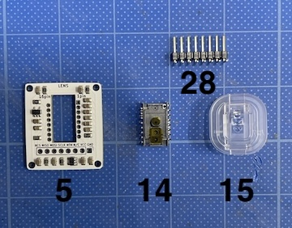
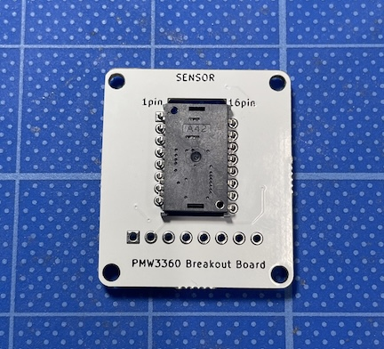
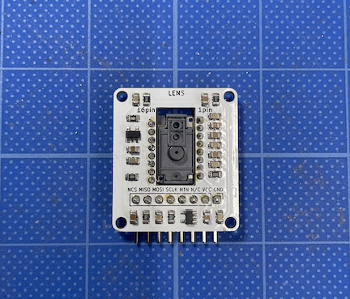
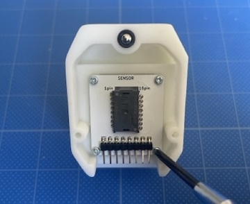
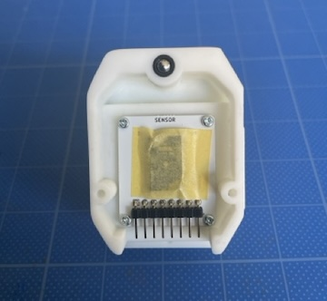

### Monkeypad Build Guide Top Page is here [English](01_build_guide.md)）

  - [6. PMW3360の組み立て](06_トラックボール_PMW3360.md)
    - [6-1. 使用する部品](./06_PMW3360.md/#6-1使用する部品)
    - [6-2. PMW3360部品のはんだ付け](/.06_PMW3360.md/#6-2MW3360部品のはんだ付け)
    - [6-3. トラックボールモジュールの組み立て](./06_PMW3360.md/#6-3トラックボールモジュールの組み立て)  

### 6-1．使用する部品

続いて、トラックボールモジュールの組み立てです。
トラックボールは、PIXART社製のPMW3360DM-T2QU光学式マウスセンサーを使用しています。センサーチップはSENSOR側にあり、あらかじめ小さい部品が実装されている側はレンズ(LENS)側です。

| No | 名前 | 数 | 備考 |
|:-|:-|:-|:-|
|  5 | トラックボールPCBA基板 | 1個 ||
| 12 | トラックボールカバー | 1個 ||
| 14 | トラックボールセンサー(PMW3360) | 1個 ||
| 15 | トラックボールセンサー用レンズ(LM19) | 1個 ||
| 28 | ピンヘッダ8ピンL型 | 1個 ||
| 40 | タッピングネジ M2 x 5mm | 4個 ||
| - | トラックボール | 1個 | キットに含まれていません。

### 6-2．PMW3360部品のはんだ付け

[5]トラックボールPCBA基板のSENSOR側の面に[14]トラックボールセンサーを搭載します。
**重要:**
写真を見て、上下の向きに注意してください。

  

LENS側の面をハンダづけします

 

LENSのフィルムをピンセットで剥がします

  

[28]8ピンL型のピンヘッダを水平に取り付くようにハンダづけします。

  

[15]トラックボールセンサー用レンズをはめます。トラックボール基板の完成です。

  

### 6-3. トラックボールモジュールの組み立て

[40]M2タッピングビスでモジュールを[12]トラックボールカバーに固定します。

  

レンズがカタついたり斜めに取り付くとセンサーが正確に認識しない場合があります。その場合は、裏からマスキングテープでレンズが動かないように固定します。

  

トラックボールモジュールの完成です。

  

  - [次へ(07_サブボード)](07_サブボード.md)

  - [次へ(サブボードをロープロファイルに変更される場合はこちら)](low_profile/07_サブボード_ロープロ.md)
