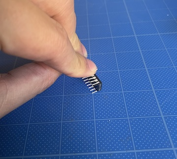
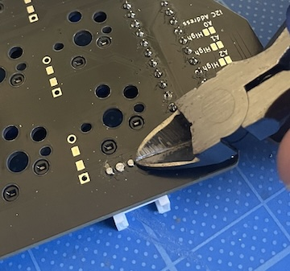
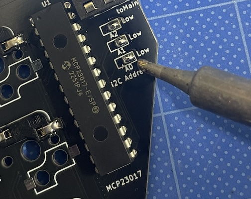
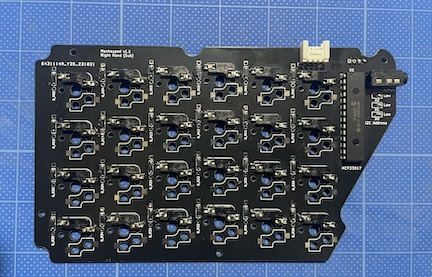

### Monkeypad Build Guide Top Page is here [English](01_build_guide.md)）

  - [7. サブボードの組み立て（左/右）](07_サブボード.md)
    - [7-1. 使用する部品](./07_サブボード.md/#7-1使用する部品)
    - [7-2. サブボード部品のはんだ付け](./07_サブボード.md/#7-2サブボード部品のはんだ付け)

### 7-1．使用する部品

片側１枚あたり以下の部品を使用します。反対側も左右対称で同様に組み立てます。

| No | 名前 | 数 |
|:-|:-|:-|
|  2 | サブPCB基板(左/右) | 1枚 |
|  8 | サブトッププレート(左/右) | 1枚 |
|  9 | サブボトムプレート(左/右) | 1枚 |
| 11 | サブボディ(左/右) | 1個 |
| 23 | IOエキスパンダ(MCP23017) | 2個 | |
| 26 | TRRSジャック | 1個 |
| 31 | Groveコネクタ | 1個 |
| 32 | Kailh キースイッチソケット | 24個 |
| 33 | ダイオード(SMD) | 24個 |

### 7-2．サブボード部品のはんだ付け

部品の実装は全て部品名がシルク印刷されてある裏面になります。
写真のように[33]ダイオードを片側に24個取り付けます。向きに注意してください。四角のスルーホール側がカソード側（線が印字されている方）です。

キースイッチの[32]ソケットを片側24個取り付けていきます。

[23]IOエキスパンダをはんだ付けします。ICの切り欠きの方向をシルク印刷に合わせて取り付けてください。

少しピンが開いていて入れづらいので、手や机で軽く押してスルーホールに合わせてください。

はんだ付けをする前に全ての足がスルーホールから出ているか確認してください。

[26]TRRSジャックをマスキングテープなどで固定すると作業しやすくなります。

I2Cの拡張コネクタである[31]GROVEコネクタを取り付けます。同じ2mmピッチの4ピンのスルーホールが近くにありますので間違えないように注意してください。

GROVE I2Cと印刷されているパッドに上向きに取り付けます。

はんだ付けした後、はみ出しているIOエキスパンダ、TRRSジャック、GROVEコネクタの足をニッパーで切ります。

I2C Addressのソルダージャンパーをはんだを流し込んでショートさせます。これは、IOエキスパンダのI2Cアドレスを指定するものです。A0, A1, A2をすべてLowにショートさせます。

パッドをこて先で温めてから、はんだを溶かすとブリッジできます。

※ I2Cアドレスを変更したい場合は反対側の面にHighがあります。Lowと表面のHighの両方を同時にショートさせて、電源に接続しないでください。故障する可能性があります。変更する場合はソースコード、ファームウェアもあわせて変更する必要があります。

サブボードの完成です。

反対側も同様に実装します。

  - [次へ(08_メインボードの実装)](08_メインボード.md)

オプションでロープロファイルに変更したい場合はこちら

  - [ロープロファイルキースイッチを標準キットに追加する場合](./07_サブボード.md/#7-3ロープロファイルキースイッチを標準キットに追加する場合)
