## 日本語のビルドガイドはこちら [Japanese](../Japanese/01_build_guide.md)

### Standard Specifications

### Low-Profile Specifications (Can be changed by adding parts after assembling the standard specifications)

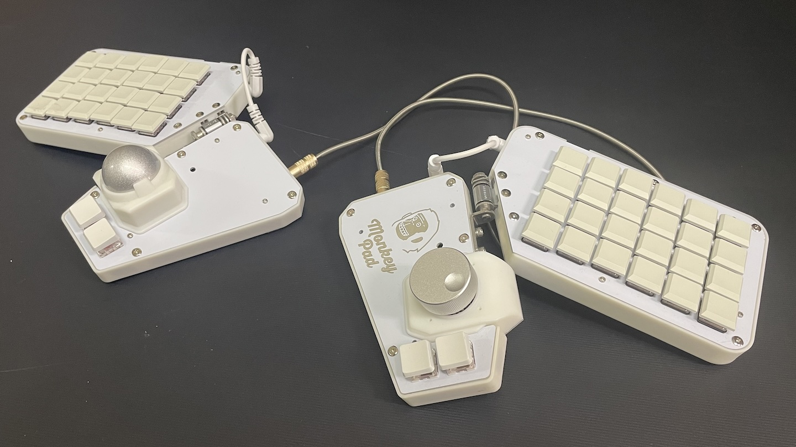

- [1. Before Assembly](01_build_guide.md)
  - [1-1. Kit Contents](#1-1Kit-Contents)
  - [1-2. Parts to Prepare by Yourself Before Assembly](#1-2Parts-You-Need-to-Prepare-Yourself-Before-Assembly)
  - [1-3. Options](#1-3Supported-Options)
  - [1-4. Additional Modules](#1-4Additional-Modules)
- [2. Preparation](02_preparation.md)
  - [2-1. Required Tools](./02_preparation.md/#2-1Required-Tools)
- [3. Soldering](03_soldering.md)
  - [3-1. Before Soldering](./03_soldering.md/#3-1Assembly-Instructions)
  - [3-2. Installing Diodes](./03_soldering.md/#3-2Installing-the-Diodes)
  - [3-3. Installing Resistors](./03_soldering.md/#3-3Installing-the-Resistors)
  - [3-4. Installing Key Sockets](./03_soldering.md/#3-4Installing-the-Key-Sockets)
- [4. Assembling the Joystick](04_joystick.md)  
  - [4-1. Components](./04_joystick.md/#4-1Components)
  - [4-2. Assembling the Joystick Module](./04_joystick.md/#4-2Soldering-the-Joystick-Components)
  - [4-3. Installing the Joystick](./04_joystick.md/#4-3Assembling-the-Joystick-Module)
- [5. Assembling the Encoder](05_encoder.md)
  - [5-1. Components](./05_encoder.md/#5-1Components)
  - [5-2. Soldering Encoder Components](./05_encoder.md/#5-2Soldering-the-Encoder-Components)
  - [5-3. Assembling the Encoder Module](./05_encoder.md/#5-3Assembling-the-Encoder-Module)
- [6. Assembling the Trackball Module (PMW3389)](06_trackball_PMW3389.md)
  - [6-1. Components](./06_trackball_PMW3389.md/#6-1Components)
  - [6-2. Soldering PMW3389 Components](./06_trackball_PMW3389.md/#6-2Soldering-the-PMW3389-Components)
  - [6-3. Assembling the Trackball](./06_trackball_PMW3389.md/#6-3Assembling-the-Trackball-Module)
- [7. Assembling the Sub-Board (Left/Right)](07_sub_pcb_board.md)
  - [7-1. Components](./07_sub_pcb_board.md/#7-1Components)
  - [7-2. Soldering Sub-Board Components](./07_sub_pcb_board.md/#7-2Soldering-the-Sub-Board-Components)
- [8. Assembling the Main Board (Left/Right)](08_main_pcb_board.md)
  - [8-1. Components](./08_main_pcb_board.md/#8-1Components)
  - [8-2. Soldering Main Board Components](./08_main_pcb_board.md/#8-2Soldering-the-Main-Board-Components)
- [9. Preliminary Test](09_pre_test.md)
  - [9-1. Writing the Test Firmware](./09_pre_test.md/#9-1Writing-the-Test-Firmware)
  - [9-2. Testing](./09_pre_test.md/#9-2Testing)
- [10. Assembly](10_assembly.md)
  - [10-1. Assembling the Main Board](./10_assembly.md/#10-1Assembly-of-the-Main-Board)
  - [10-2. Attaching the Tripod Adapter](./10_assembly.md/#10-2Attaching-the-Tripod-Adapter)
  - [10-3. Assembling the Sub-Board](./10_assembly.md/#10-3Assembling-the-Sub-Board)
  - [10-4. Attaching the Rubber Pads](./10_assembly.md/#10-4Attaching-the-Rubber-Pads)
- [11. Finished!](11_finished.md)
  - [11-1. Writing the Firmware](./11_finished.md/#11-1Writing-the-Firmware)
  - [11-2. Testing](./11_finished.md/#11-2Testing)

## 1. Before You Start

### 1-1.Kit Contents

Monkeypad consists of a main board featuring a Raspberry Pi Pico that users can customize freely, along with a sub-board for mounting a 4x6 key switch layout and multiple modules.

Additionally, the included key sockets are only standard MX Kailh key switch sockets. However, for 24 key switches on one side of the sub-board, you can change or add low-profile key switches with lower key heights. The main board can only support MX key switches. Low-profile key socket Kailh PCB socket choc version is sold separately.

Please note that creating low-profile configurations differs from the standard setup in the following steps.

  - [07. Sub-board](low_profile/07_Sub-board_low_profile.md)
  - [10. Assembly](low_profile/10_Assembly_low_profile.md)

The included items in the standard kit are as follows:

| No | Name |	Quantity | Spare |
|:-|:-|:-|:-|
| 1 | Main PCB Board (Left/Right) | 1 set (2 pcs)	||
| 2 | Sub PCB Board (Left/Right) | 1 set (2 pcs) ||
| 3 | Joystick PCB Board | 1 piece	||
| 4 | Encoder PCB Board | 1 piece	||
| 5 | Trackball PCBA Board | 1 piece ||

| No | Name	| Quantity | Spare |
|:-|:-|:-|:-|
| 6	| Main Top Plate (Left/Right) | 1 set (2 pcs)	||
| 7	| Main Bottom Plate (Left/Right) | 1 set (2 pcs) ||	
| 8	| Sub Top Plate (Left/Right) | 1 set (2 pcs) ||
| 9	| Sub Bottom Plate (Left/Right) | 1 set (2 pcs) ||	

| No | Name	| Quantity | Spare |
|:-|:-|:-|:-|
| 6 | Main Top Plate (Left/Right) | 1 set (2 pieces) ||
| 7 | Main Bottom Plate (Left/Right) | 1 set (2 pieces) ||	
| 8 | Sub Top Plate (Left/Right) | 1 set (2 pieces) ||
| 9 | Sub Bottom Plate (Left/Right) | 1 set (2 pieces) ||	

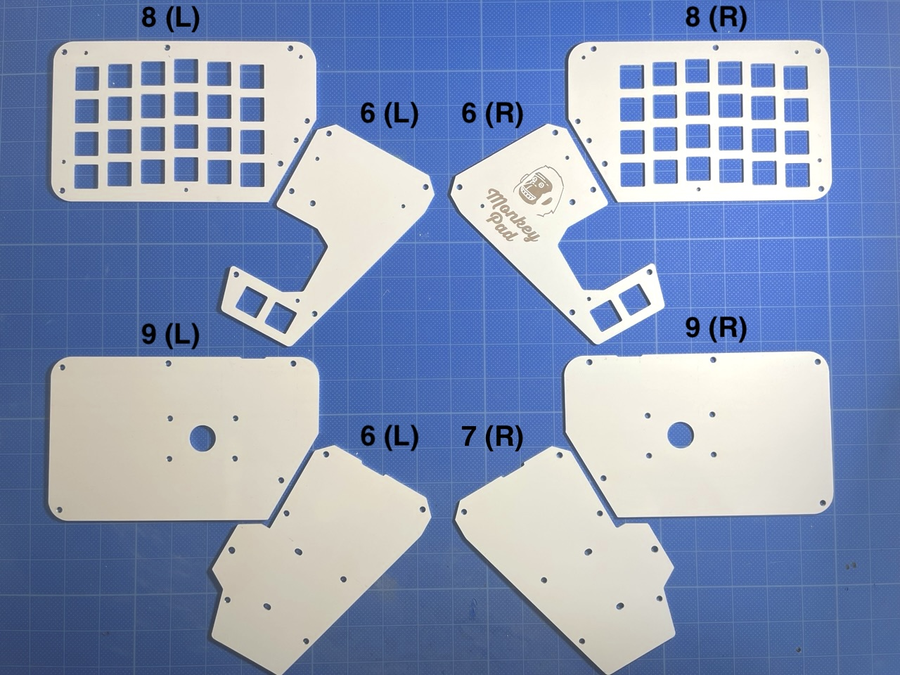     

| No | Name	| Quantity | Spare |
|:-|:-|:-|:-|
| 10 | Main Body (Left/Right) | 1 set (2 pieces) | |
| 11 | Sub Body (Left/Right) | 1 set (2 pieces) | |
| 12 | Trackball Cover | 1 piece | |
| 13 | Joystick Cover, Encoder Cover | 2 pieces (common) | |

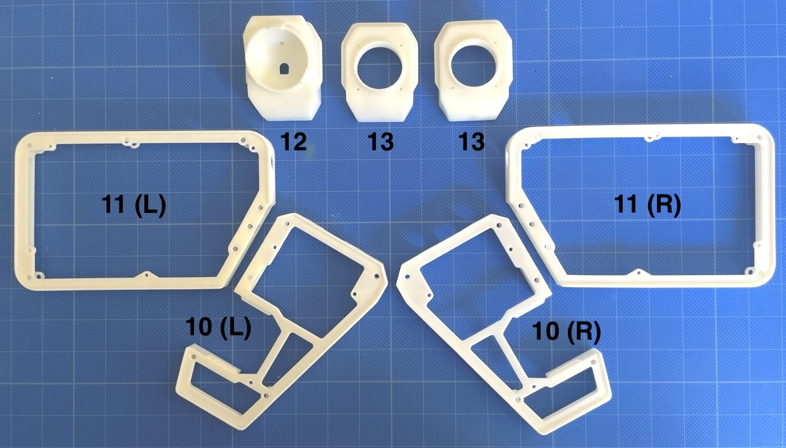     

| No | Name	| Quantity | Spare |
|:-|:-|:-|:-|
| 14 | Trackball Sensor (PMW3389) | 1 piece | |
| 15 | Trackball Sensor Lens (LM19) | 1 piece | |
| 16 | Encoder | 1 piece | |
| 17 | Encoder Knob | 1 piece | |
| 18 | Joystick | 1 piece | |
| 19 | Joystick Thumbstick | 1 piece | |

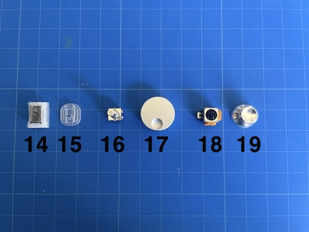     

| No | Name	| Quantity | Spare |
|:-|:-|:-|:-|
| 20 | Main Unit Left-Right TRRS Cable | 1 piece | |
| 21 | TRRS Cable Between Main and Sub Units | 2 pieces | |
| 22 | Torque Hinges | 2 pieces | |

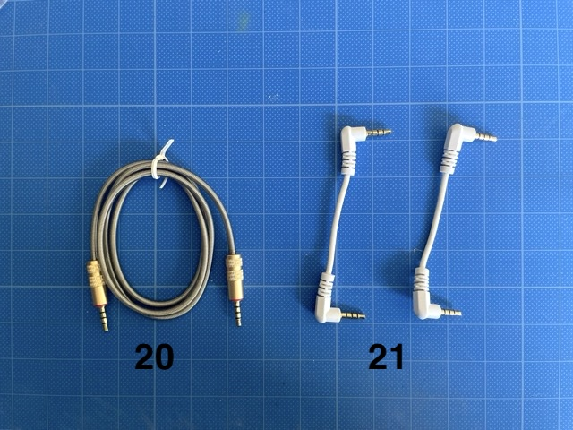 

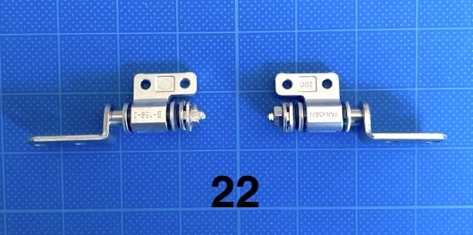     

| No | Name	| Quantity | Spare |
|:-|:-|:-|:-|
| 23 | IO Expander (MCP23017) | 2 pieces | |
| 24 | Tact Switch | 2 pieces | |
| 25 | LED (SK6812MINI-E) | 3 pieces | 1 spare piece |
| 26 | TRRS Jack | 6 pieces | |
| 27 | 8-Pin L-Shaped Pin Socket | 2 pieces | |
| 28 | 8-Pin L-Shaped Pin Header | 3 pieces | |
| 29 | 20-Pin Pin Header | 4 pieces | |
| 30 | 3-Pin Pin Header | 2 pieces | |
| 31 | Grove Connector | 2 pieces | |

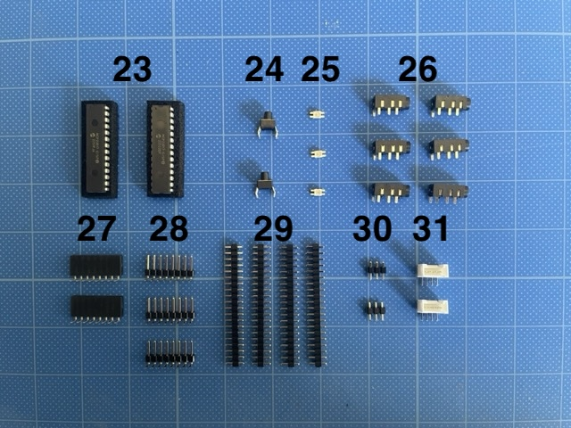     

| No | Name	| Quantity | Spare |
|:-|:-|:-|:-|
| 32 | Kailh Key Switch Sockets | 55 pieces | 3 spare pieces |
| 33 | Diodes (SMD) | 58 pieces | 4 spare pieces |
| 34 | Resistors (4.7kΩ) | 8 pieces | 2 spare pieces |
| 35 | Resistors (10kΩ) | 8 pieces | 2 spare pieces |

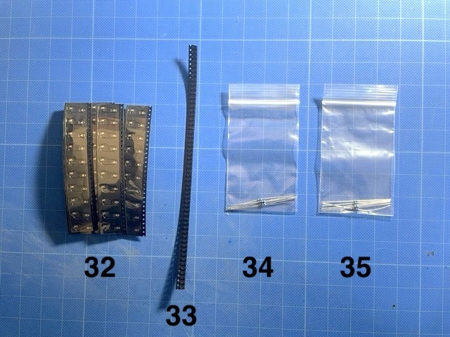     

| No | Name	| Quantity | Spare |
|:-|:-|:-|:-|
| 36 | Hex Double Male Threaded Standoffs | 20 pieces | 2 spare pieces |
| 37 | Low-Profile Screws M3 x 6mm | 48 pieces | 2 spare pieces |
| 38 | Low-Profile Screws M3 x 12mm | 9 pieces | 1 spare piece |
| 39 | Screws M2 x 8mm | 16 pieces | 2 spare pieces |
| 40 | Self-Tapping Screws M2 x 5mm | 15 pieces | 3 spare pieces |
| 41 | Hex Nuts M3 | 18 pieces | 2 spare pieces |
| 42 | Hex Nuts M2 | 16 pieces | 2 spare pieces |

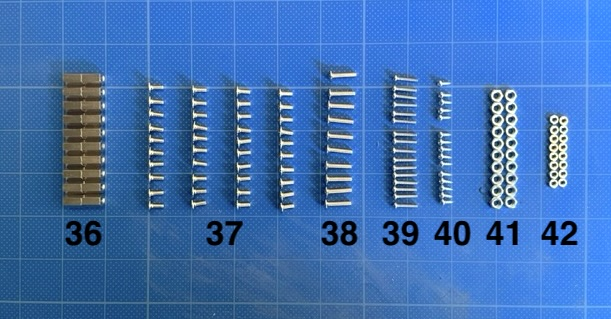     

| No | Name	| Quantity | Spare |
|:-|:-|:-|:-|
| 43 | Spacers | 10 pieces | 2 spare pieces (for low-profile use)|
| 44 | Rubber Feet | 10 pieces | |
| 45 | Grommets | 2 pieces | |

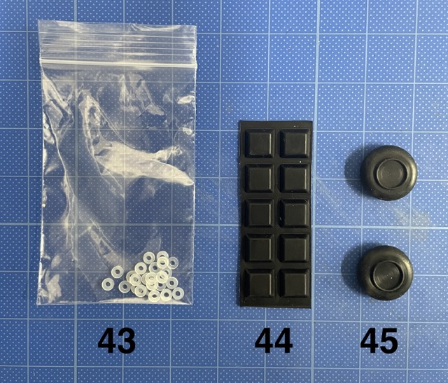     

Bonus Item:
| No | Name	| Quantity | Spare |
|:-|:-|:-|:-|
| 46 | Tripod Adapters with Screws | 2 pieces | |

This is a bonus item. Please note that since it was made using a home 3D printer, the quality is not very high.

     

<!-- Photo to be retaken -->

### 1-2.Parts You Need to Prepare Yourself Before Assembly

Although it works with the Pico W, QMK does not support wireless functionality. Pico-compatible products can also be installed.

| No | Name	| Quantity | Notes |
|:-|:-|:-|:-|
| 51 | [Raspberry Pi Pico](https://shop.yushakobo.jp/products/raspberry-pi-pico) | 2 pieces |  |

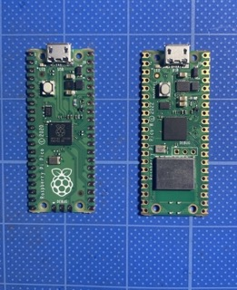

| No | Name	| Quantity | Notes |
|:-|:-|:-|:-|
| 52 | [Cherry MX Compatible Key Switches](https://shop.yushakobo.jp/collections/all-switches) | 52 pieces | If configuring the sub-board for low-profile use, only 4 pieces are necessary |

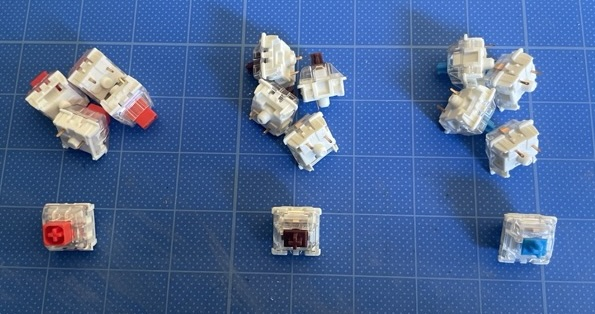

| No | Name	| Quantity | Notes |
|:-|:-|:-|:-|
| 53 | [Keycaps](https://shop.yushakobo.jp/collections/keycaps) | 52 pieces |  |

| No | Name	| Quantity | Notes |
|:-|:-|:-|:-|
| 54 | Trackball with 34mm Diameter | 1 piece |  |

| No | Name	| Quantity | Notes |
|:-|:-|:-|:-|
| 55 | [Micro USB Cable](https://shop.yushakobo.jp/products/usb-cable-micro-b-0-8m)| 1 piece | |

### 1-3.Supported Options

The PCB supports MAC8 "Conthrough" connectors, popular in DIY keyboards, allowing the MCU (Raspberry Pi Pico) to be replaceable. If needed, please use the Conthrough 20-pin with a height of 2.5mm (low-profile). If you do not plan to replace the Raspberry Pi Pico, this is unnecessary.

Options Required Before Assembly

| No | Name	| Quantity | Notes |
|:-|:-|:-|:-|
| 56 | [Conthrough 20-pin Height 2.5mm (Low-Profile)](https://talpkeyboard.net/items/6326b97df308654990631828) | 4個 | If you want to make the Pico replaceable (usually unnecessary) |

Options That Can Be Added Even After Assembly

Only necessary if you want to configure the sub-board for low-profile use (it can also be modified later by adding it).

| No | Name	| Quantity | Notes |
|:-|:-|:-|:-|
| 47 | [Low-Profile Key Switches] | 48 pieces |
| 48 | [Low-Profile Keycaps] | 48 pieces |
| 49 | [Kailh PCB Sockets for Choc Switches](https://shop.yushakobo.jp/products/a01ps?_pos=1&_sid=fdcb377c7&_ss=r&variant=37665172553889)| 48 pieces |
| 50 | [SH Connector 3-Pin Side SM03B-SRSS-TB](https://eleshop.jp/shop/g/gE23138/) | 2 pieces | If using DEBUG pins (usually unnecessary)|

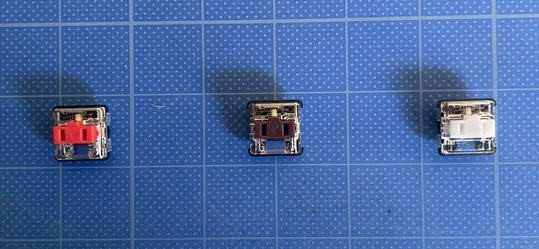

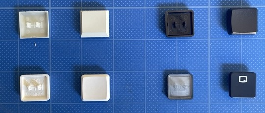

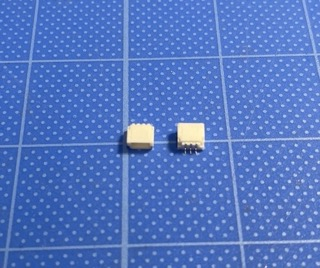

### 1-4.Additional Modules
**Sold Separately**
While one module each of the trackball sensor, rotary encoder, and joystick is included as standard, you can freely customize according to your needs—for example, by using dual trackballs or dual joysticks. We are also preparing to sell custom rotary encoders, joysticks, and trackballs for additional purchase.

| No | Name	| Quantity |
|:-|:-|:-|
| 61 | Trackball Module (Trackball body not included) | Set |
| 62 | [Trackball Sensor and Sensor Board Set](https://monkeypad.booth.pm/items/4976744) | Set |
| 63 | Analog Joystick Module | Set |
| 64 | Encoder Module | Set |

  - [Next(02_build_preparation)](02_preparation.md)

