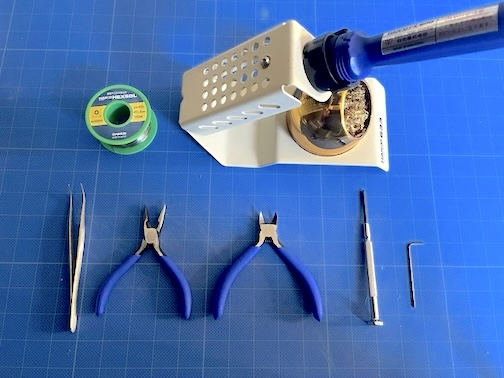
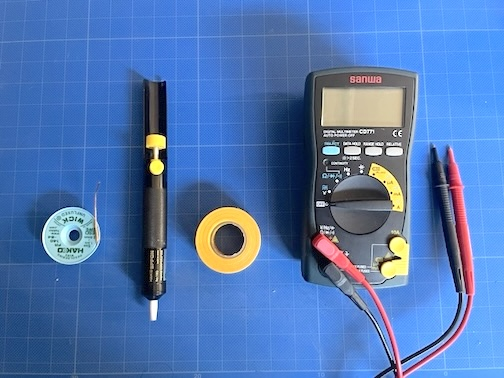

<!-- ### Monkeypad Build Guide Top Page is here [English](01_build_guide.md)  -->

  - [2. Build Preparation](02_build_preparation.md)
    - [2-1. Required Tools](./02_build_preparation.md/#2-1Required_Tools)

## 2.Build Preparation
### 2-1.Required Tools

If you already have knowledge, experience, and tools related to DIY keyboards, you can skip ahead to Assembling the Analog Joystick.

For those not accustomed to soldering, we recommend using solder with a low melting point of around 200°C and a soldering iron that can adjust the temperature to around 270°C to prevent overheating.

Tools Required for Assembling the Monkeypad:

| No | Tool |
|:-|:-|
| 1 | Soldering iron (temperature-adjustable recommended), soldering iron stand |
| 2 | Solder (leaded solder with a low melting point is easier to work with) |
| 3 | Screwdrivers |
| 4 | Tweezers |
| 5 |	Wire cutters |
| 6 | Needle-nose pliers |

### Additional Tools That Make the Work Easier

While not mandatory, the following tools can be helpful:

Masking Tape: Used to temporarily hold components in place to prevent them from lifting during assembly.
Solder Sucker or Desoldering Braid: Useful for removing solder if you make a mistake during soldering.
Multimeter: Convenient for checking if keys are responding correctly, verifying diode orientation, and measuring resistance values.
7mm Wrench: Used to adjust the tightness of the torque hinge. Although needle-nose pliers can be used as a substitute, using a wrench prevents scratches.
Work Tray: A small container to keep tiny parts organized and prevent them from getting lost during assembly.

List of Helpful Tools:

| No | Tool |
|:-|:-|
| 8 | Solder Sucker or Desoldering Braid |
| 9 | Masking Tape |
| 10 | Multimeter |
| 11 | 7mm Socket Wrench or 7mm Spanner |
| 12 | Work Tray (Container for Small Parts) |

  - [3. Soldering](03_soldering.md)
