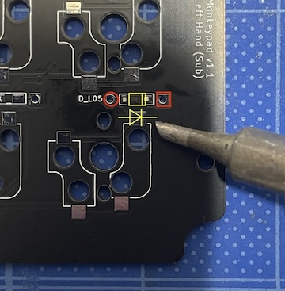
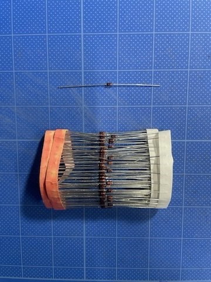
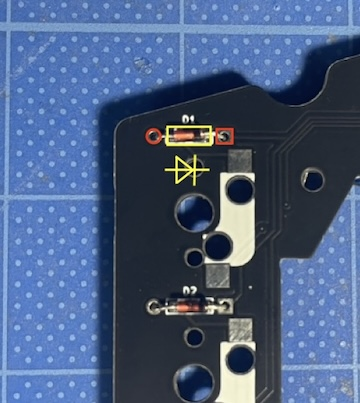
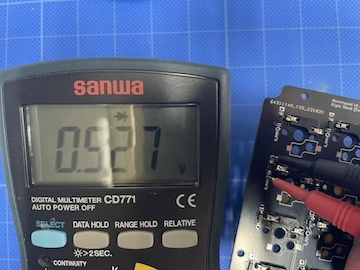
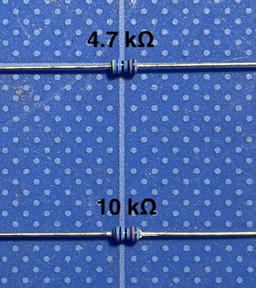

- [3. Soldering](03_soldering.md)
  - [3-1. Before Soldering](./03_soldering.md/#3-1Assembly-Instructions)
  - [3-2. Installing Diodes](./03_soldering.md/#3-2Installing-the-Diodes)
  - [3-3. Installing Resistors](./03_soldering.md/#3-3Installing-the-Resistors)
  - [3-4. Installing Key Sockets](./03_soldering.md/#3-4Installing-the-Key-Sockets)

## 3.Soldering
### 3-1.Assembly Instructions
If you already have knowledge and experience with DIY keyboards, you can skip ahead to Assembling the Analog Joystick.

Note: Most of the Monkeypad components are mounted on the back (underside) of the PCB. (However, soldering is not necessarily limited to the backside.)

### 3-2.Installing the Diodes

For ease of assembly, we have included SMD (Surface Mount Device) high-speed switching diodes (1N4148W).

Diodes have polarity (anode and cathode), so please make sure to install them in the correct orientation. Carefully examine the photo below to confirm the direction. All diodes are soldered in the same orientation on the backside of the PCB.

All diodes on the same PCB are aligned in the same direction. While soldering, please ensure that all diodes are facing the same way.

Diode Installation

If you're not confident with soldering SMD components, you can also use leaded 1N4148 diodes (sold separately). Soldering leaded diodes is easier but requires more effort compared to the included SMD type.

Leaded Diodes

When soldering, ensure that the side of the diode with the line (cathode side) aligns with the square pad of the through-hole on the PCB, which is used for conductivity. The same applies to leaded types; attach the side with the line to the square hole.

Diode Orientation

You can visually confirm the orientation of the diodes, but you can also use a multimeter to check. In diode test mode, connect the positive probe to the anode and the negative probe to the cathode. If the diode is installed correctly, it will measure approximately 0.5V. If the orientation is incorrect, no current will flow, and the multimeter will display "O.L" (over limit) or "O.F" (open circuit).

### 3-3.Installing the Resistors

The MonkeyPad uses two types of resistors: 4.7 kΩ and 10.0 kΩ. Please check the resistance values silk-screened on the PCB to ensure you're installing the correct ones.

To avoid confusion with the diodes, we've included lead-type resistors. (You can also use SMD types if you prefer.) Unlike diodes, resistors have no polarity, so orientation doesn't matter.

If the two types of resistors get mixed up, you can identify them using the following methods:

Using a Multimeter: Measure the resistance in resistance measurement mode.

By Color Code: Visually distinguish them by their color bands.

4.7 kΩ: Yellow – Purple – Black – Red – Brown
10.0 kΩ: Brown – Black – Black – Red – Brown

 

### 3-4.Installing the Key Sockets

The MonkeyPad standard kit includes 55 Kailh key switch sockets for MX switches (with 3 spares).

For the 24 key switches on one side of the sub-board, you can later add or change them to low-profile switches. The main board (which has 2 key switches) can only accommodate standard key switches. Low-profile key sockets, such as Kailh PCB sockets for Choc switches, are sold separately.

  - [Next(04_joystick)](04_joystick.md)  
