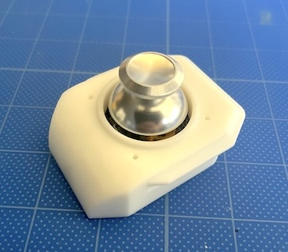

<!-- ### Monkeypad Build Guide Top Page is here [English](01_build_guide.md)  -->

## 4,5,6Assembly of Module Boards

First, we will begin by assembling the three modules: the joystick, encoder, and trackball.

     

  - [4. Assembly of the Joystick](04_joystick.md)  
    - [4-1. Components](./04_joystick.md/#4-1Components)
    - [4-2. Soldering the Joystick Components](./04_joystick.md/#4-2Soldering the Joystick Components)
    - [4-3. Assembling the Joystick Module](./04_joystick.md/#4-3Assembling the Joystick Module)

### 4-1.Components

| No | Name |	Quantity |
|:-|:-|:-|
| 3 | Joystick PCB Board | 1 piece	|
| 18 | Joystick | 1 piece | 
| 28 | 8-Pin L-Shaped Pin Header | 1 piece |
| 33 | Diodes (SMD) | 1 piece |

| No | Name |	Quantity |
|:-|:-|:-|
| 13 | Joystick Cover | 1 piece |
| 19 | Joystick Thumbstick | 1 piece |
| 40 | Self-Tapping Screws M2 x 5mm | 4 pieces |

### 4-2.Soldering the Joystick Components

Let's begin soldering.

Mount the [18] Joystick on the front (Top) side of the [3] Joystick PCB Board. The diode and pin header, except for the joystick, are installed on the back (Bottom) side. Please note that soldering will be required on both the front and back sides.

First, on the Bottom side, install one [33] Diode at the location marked in yellow in the diagram. The square through-hole side is the cathode side (the side with the printed line). Be careful with the diode's orientation.

Next, attach the L-shaped (28) pin header to the Bottom side and solder it from the opposite (Top) side.

**Important**

Mount the L-shaped pin header horizontally on the side silk-screened with `Pin Header`. Pay attention to the orientation in the photos (the longer pins should be horizontal). First, solder 1–2 pins to temporarily fix it in place and ensure it is level, then solder all the pins.

Next, attach the joystick to the opposite Top side. Place the joystick on the side with the `+` mark, not on the side with the `×` mark.

While being careful not to tilt the joystick, fix it in place with masking tape or support it by hand, and solder all the pins on the opposite side.

The joystick PCB assembly is now complete.

### 4-3.Assembling the Joystick Module

Secure the module to the case using M2 self-tapping screws.

Push the thumbstick all the way in to complete the joystick module.

  - [Next(05_rotary_encoder)](05_rotary_encoder.md)
