<!-- ### Monkeypad Build Guide Top Page is here [English](01_build_guide.md)  -->

- [5. Assembling the Encoder](05_encoder.md)
  - [5-1. Parts Used](./05_encoder.md/#5-1-parts-used)
  - [5-2. Soldering Encoder Components](./05_encoder.md/#5-2-soldering-encoder-components)
  - [5-3. Assembling the Encoder Module](./05_encoder.md/#5-3-assembling-the-encoder-module)

### 5-1.Components

| No | Name |	Quantity |
|:-|:-|:-|
|  4 | Encoder PCB Board | 1 piece |
| 16 | Encoder | 1 piece |
| 28 | 8-Pin L-Shaped Pin Header | 1 piece |
| 33 | Diodes (SMD) | 1 piece |
| 35 | Resistors (10k) | 2 pieces |

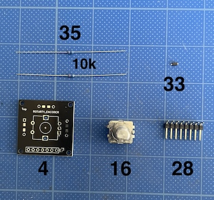

| No | Name |	Quantity |
|:-|:-|:-|
| 13 | Encoder Cover | 1 piece |
| 17 | Encoder Knob | 1 piece |
| 40 | Self-Tapping Screws M2 x 5mm | 4 pieces |

### 5-2.Soldering the Encoder Components

Just like with the joystick, attach one [33] Diode and an [28] 8-Pin L-Shaped Pin Header to the back (Bottom) side of the [4] Encoder PCB Board. Pay attention to the diode's orientation.

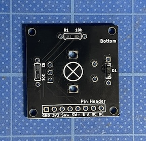

**Important**

Mount the pin header horizontally on the side silk-screened with `Pin Header`. First, solder 1–2 pins to temporarily hold it in place and ensure it is level, then solder all the pins.

Next, attach two [35] 10 kΩ resistors to the same Bottom side. Resistors have no polarity, so orientation doesn't matter.

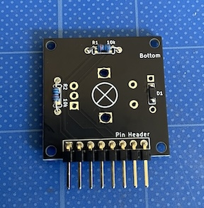

Solder them from the opposite side. Use wire cutters to trim any excess leads protruding through.

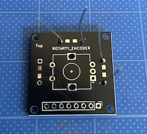
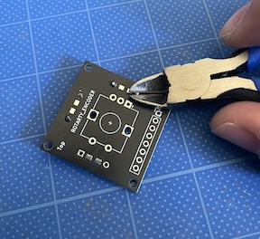

On the opposite (Top) side labeled ROTARY ENCODER, mount the [16] `ROTARY ENCODER`. Place the encoder on the side with the `+` mark, not on the side with the `×` mark.

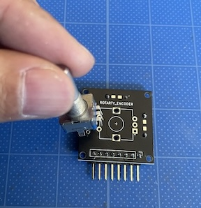

While being careful not to tilt the rotary encoder, fix it in place with masking tape or support it by hand, and solder all the pins from the opposite side.

The encoder PCB assembly is now complete.

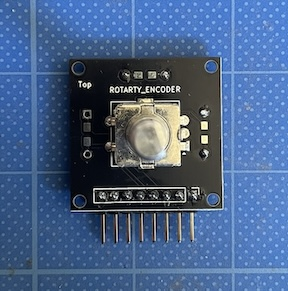

### 5-3.Assembling the Encoder Module

Secure the module to the [13] Encoder Cover using [40] M2 x 5mm Self-Tapping Screws.

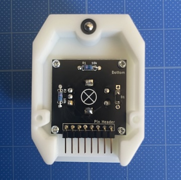

Insert the [17] Encoder Knob. Use a hex wrench to tighten the set screw so that it aligns with the flat side of the shaft.

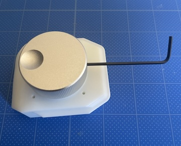

The encoder has a built-in switch that can be pressed from the top.

Do not push the knob all the way down; leave a gap of about 2 mm so that it can be clicked when pressed from above, then tighten the set screw to fix it in place.

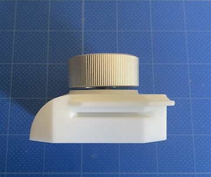

The encoder module assembly is now complete.

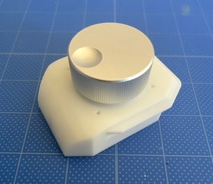

  - [Next(06_trackball_PMW3389)](06_trackball_PMW3389.md)
