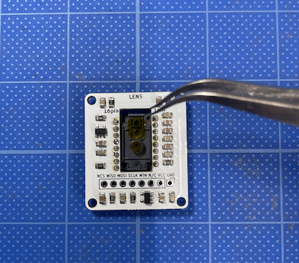

- [6. Assembling the Trackball Module (PMW3389)](06_trackball_PMW3389.md)
  - [6-1. Components](./06_trackball_PMW3389.md/#6-1Components)
  - [6-2. Soldering PMW3389 Components](./06_trackball_PMW3389.md/#6-2Soldering-the-PMW3389-Components)
  - [6-3. Assembling the Trackball](./06_trackball_PMW3389.md/#6-3Assembling-the-Trackball-Module)

### 6-1.Components

Next, we'll assemble the trackball module.

The trackball uses the high-performance PMW3389DM-T3QU optical mouse sensor manufactured by PIXART. The sensor chip is located on the SENSOR side, and the side where small components are pre-mounted is the LENS side.

| No | Name	| Quantity | Notes |
|:-|:-|:-|:-|
|  5 | Trackball PCBA Board | 1 piece ||
| 12 | Trackball Cover | 1 piece ||
| 14 | Trackball Sensor (PMW3389) | 1 piece ||
| 15 | Trackball Sensor Lens (LM19) | 1 piece ||
| 28 | 8-Pin L-Shaped Pin Header | 1 piece ||
| 40 | Self-Tapping Screws M2 x 5mm | 4 pieces ||
| - | Trackball | 1 piece | Not included in the kit |

### 6-2.Soldering the PMW3389 Components

Mount the [14] Trackball Sensor on the "SENSOR" side of the [5] Trackball PCBA Board.

Important Please pay attention to the orientation (up and down) as shown in the photo.

**Important**
Please pay attention to the orientation (up and down) as shown in the photo.

  

Solder on the side labeled "LENS".

 

Peel off the film from the LENS using tweezers.

  

Solder the [28] 8-Pin L-Shaped Pin Header horizontally.

  

Attach the [15] Lens for the Trackball Sensor. The trackball board is now complete.

  

### 6-3.Assembling the Trackball Module

Secure the module to the [12] Trackball Cover using [40] M2 x 5mm Self-Tapping Screws.

  

If the lens is loose or installed at an angle, the sensor may not function accurately. In that case, fix the lens from the back using masking tape to prevent it from moving.

  

The trackball module assembly is now complete.

  

  - [Next(07_sub_pcb_board)](07_sub_pcb_board.md)

If you want to switch to the low-profile option:

  - [Next(If you are changing the sub-board to low-profile, click here)](low_profile/07_sub_pcb_board_low_profile.md)
