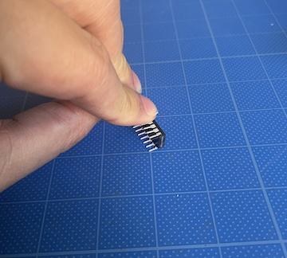
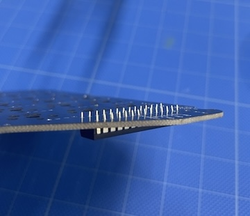

<!-- ### Monkeypad Build Guide Top Page is here [English](01_build_guide.md)  -->

- [7. Assembling the Sub-Board (Left/Right)](07_sub_pcb_board.md)
  - [7-1. Parts Used](./07_sub_pcb_board.md/#7-1-parts-used)
  - [7-2. Soldering Sub-Board Components](./07_sub_pcb_board.md/#7-2-soldering-sub-board-components)

### 7-1.Components

Use the following parts for one side. Assemble the other side symmetrically in the same way.

| No | Name	| Quantity |
|:-|:-|:-|
|  2 | Sub PCB Board (Left/Right) | 1 piece |
|  8 | Sub Top Plate (Left/Right) | 1 piece |
|  9 | Sub Bottom Plate (Left/Right) | 1 piece |
| 11 | Sub Body (Left/Right) | 1 piece |
| 23 | IO Expander (MCP23017) | 2 pieces | |
| 26 | TRRS Jack | 1 piece |
| 31 | Grove Connector | 1 piece |
| 32 | Kailh Key Switch Sockets | 24 pieces |
| 33 | Diode (SMD) | 24 pieces |

### 7-2.Soldering the Sub-Board Components

All components are mounted on the backside where the component names are silk-screened.

As shown in the photo, attach 24 [33] Diodes on one side. Pay attention to the orientation. The square through-hole is the cathode side (the side with the printed line).

Install 24 [32] Key Switch Sockets on one side.

Solder the [23] IO Expander. Align the notch on the IC with the silk-screened marking.

The pins may be slightly spread out and difficult to insert, so gently press them with your hand or against the desk to align them with the through-holes.

Before soldering, make sure all the pins are protruding through the through-holes.

Attach the [26] TRRS Jack. It will be easier to work if you fix the TRRS jack in place with masking tape or similar.

Attach the [31] Grove Connector, which is an I2C expansion connector.

Important: Be careful not to confuse the location, as there is a nearby 2 mm pitch 4-pin through-hole. Mount it facing upwards on the pads labeled "GROVE I2C".

Attach the [31] Grove Connector, which is an I2C expansion connector.

**Important** Be careful not to confuse the location, as there is a nearby 2 mm pitch 4-pin through-hole.

Mount it facing upwards on the pads labeled "GROVE I2C".

After soldering, use wire cutters to trim the excess legs of the IO Expander, TRRS Jack, and Grove Connector that are protruding.

Bridge the solder jumpers for the I2C Address by applying solder to short them. This allows you to specify the IO Expander's I2C address externally. Short A0, A1, and A2 all to the Low side.

You can bridge the pads by heating them with the soldering iron tip and then applying solder to melt.

Note (Advanced Option): If you want to change the I2C address, there are High pads on the opposite side. Do not short both Low and High sides at the same time and connect to power; this may cause failure. If you change it, you will also need to modify the source code and firmware accordingly.

The sub-board assembly is now complete.

Assemble the other side in the same way.

  - [Next(08_main_pcb_board)](08_main_pcb_board.md)

If you want to switch to the low-profile option:

  - [Adding Low-Profile Key Switches to the Standard Kit, click here](low_profile/07_sub_pcb_board_low_profile.md)
