<!-- ### Monkeypad Build Guide Top Page is here [English](01_build_guide.md)  -->

- [8. Assembling the Main Board (Left/Right)](08_main_pcb_board.md)
  - [8-1. Components](./08_main_pcb_board.md/#8-1-parts-used)
  - [8-2. Soldering Main Board Components](./08_main_pcb_board.md/#8-2-soldering-main-board-components)

### 8-1.Components

Use the following parts for one side. Since the design is symmetrical, you will need the same parts for the other side as well.

| No | Name |	Quantity | Remark |
|:-|:-|:-|:-|
|  1 | Main PCB Board (Left/Right) | 1 piece ||
| 24 | Tact Switch | 1 piece ||
| 25 | LED (SK6812MINI-E) | 1 piece ||
| 26 | TRRS Jack | 2 pieces ||
| 27 | 8-Pin L-Shaped Pin Socket | 1 piece ||
| 29 | 20-Pin Pin Header | 2 pieces ||
| 30 | 3-Pin Pin Header | 1 piece ||
| 32 | Kailh Key Switch Sockets | 2 pieces ||
| 33 | Diode (SMD) | 2 pieces ||
| 34 | Resistors (4.7k) | 3 pieces ||
| 35 | Resistors (10k) | 2 pieces ||
| - | Raspberry Pi Pico | 1 piece | Not included in the kit |

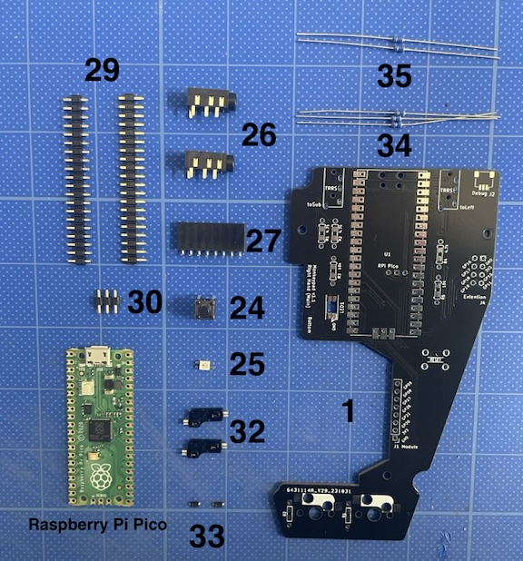

### 8-2.Soldering the Main Board Components

All components are mounted on the backside where the component names are silk-screened.

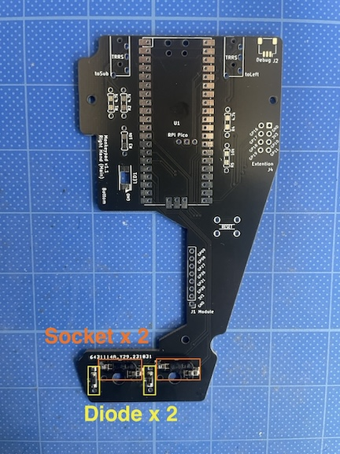

Install the [25] LED. Ensure that the emitting surface of the LED faces away from you, and align the notch (GND) with the silk-screened marking. Be careful not to apply solder at high temperatures or for too long to prevent damaging the LED.

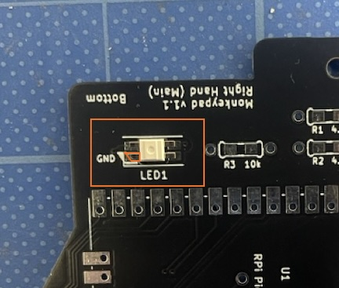

Attach two [26] TRRS Jacks.

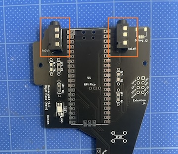

Install the [24] Tact Switches. Pay attention to the orientation of the legs as shown in the photo, and solder them accordingly.

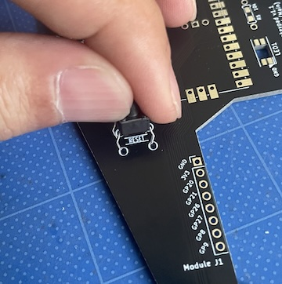

Install the resistors. There are two types: [34] 4.7 kΩ and [35] 10 kΩ resistors. Insert the legs through the holes according to the silk-screened labels, and solder from the opposite side.

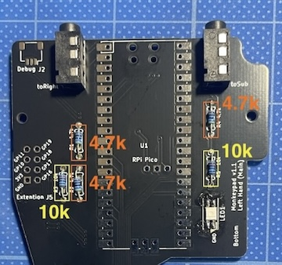

Use wire cutters to trim all excess legs from the TRRS jacks, switches, and resistors.

(Since they might touch the plate if they are too long, make sure to cut them all.)

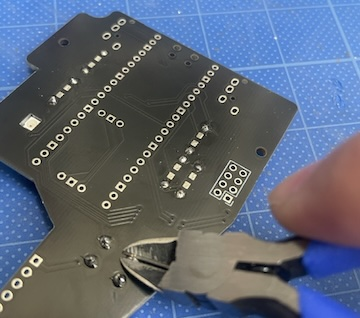

**Important**

Attach the L-shaped 8-pin socket. This is the part that connects to the modules via a sliding mechanism, so adjusting the height and angle is particularly important.

Adjust and mount it so that it is level.

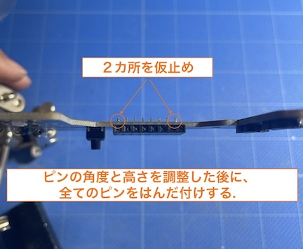
<!-- 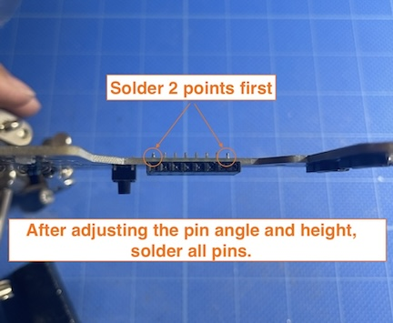 -->

Temporarily assemble the main body by sandwiching the [6] Main Top Plate and the [10][1] Main PCB Board, and try sliding one of the modules. If there are no issues with height and angle, it should slide as shown in the image.

If the height or angle is not aligned, adjust it accordingly. Once you have confirmed that the module can slide smoothly, solder all 8 pins.

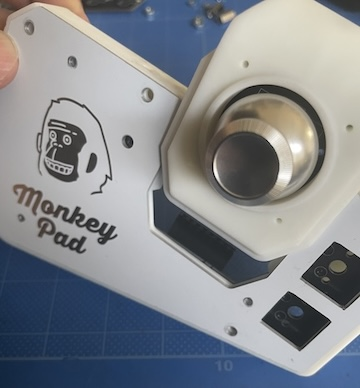

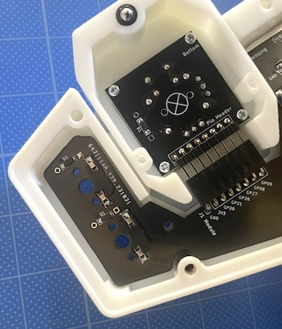

Finally, we'll solder the last component: the Raspberry Pi Pico.

Insert and solder a total of three pin headers: two [29] 20-pin Pin Headers and one [30] 3-pin Pin Header. Be sure to use 2.5 mm pin headers and do not surface-mount the Pico directly onto the board.

Note: The through-holes on the main board PCB are compatible with MAC8 Conthrough connectors (sold separately). If you use them, please use the 2.5 mm height 20-pin connectors. They are unnecessary for normal use.

Note: Since the positions of the 3-pin debug pins differ between the Raspberry Pi Pico and Pico W, there are two sets of holes. Insert the pins into the holes that match your Pico's pin positions.

Note: The 3-pin debug header is for debugging environments such as the separately sold Picoprobe. It is not used unless you are using a debugger. It is designed to be accessible from the outside, but even if you forget to insert it, there is no particular problem in normal use.

Temporarily fix the Pico with masking tape, ensuring it is seated properly without gaps. Then solder all the pins on both sides from the front.

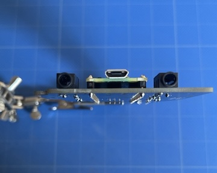

The main board assembly is now complete. Assemble the other side in the same way.

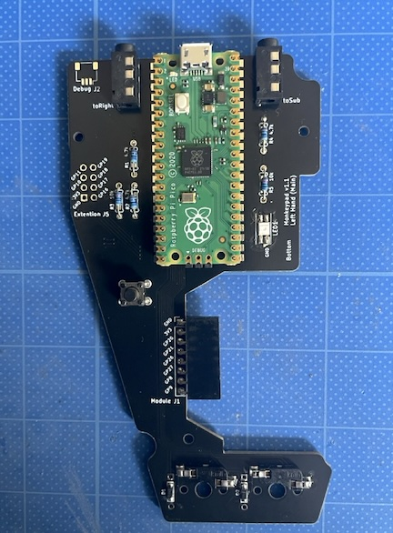

  - [Next(09_Preliminary_Test)](09_pre_test.md)
