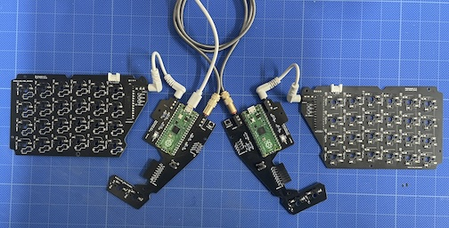
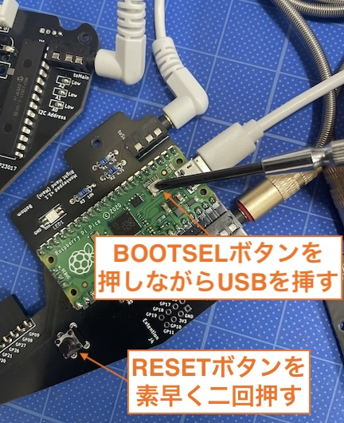
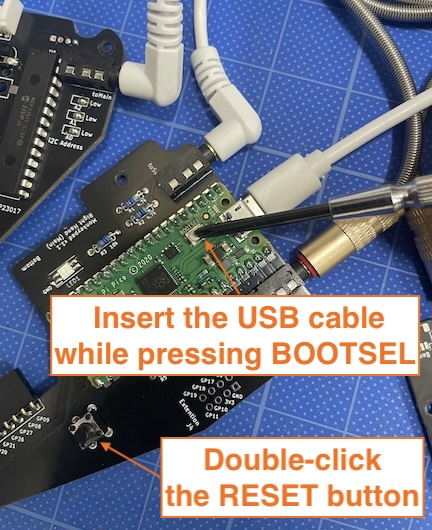
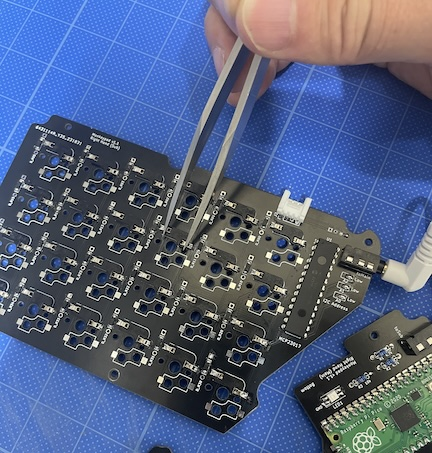

<!-- ### Monkeypad Build Guide Top Page is here [English](01_build_guide.md)  -->

- [9. Preliminary Test](09_pre_test.md)
  - [9-1. Writing the Test Firmware](./09_pre_test.md/#9-1-writing-the-test-firmware)
  - [9-2. Testing](./09_pre_test.md/#9-2-testing)

To minimize the need for rework, we recommend performing the preliminary test steps.

### 9-1.Writing the Test Firmware

Download the test firmware `monkeypad_test.uf2` below and flash it onto both the left and right Raspberry Pi Picos.

[Download monkeypad_test.uf2](https://github.com/monkeypad/monkeypad/releases/download/v0.1.0/0_mp_mk1_test.uf2)

Connect the main board and sub-board using TRRS cables as shown in the photo below, and attach a USB cable to the Raspberry Pi Pico.

To put the Raspberry Pi Pico into DFU mode and enable programming, quickly press the Reset button (tact switch) installed on the PCB twice.

It will be recognized by your PC as a USB drive named RPI-RP2.

Alternatively, you can achieve the same by holding down the BOOTSEL button on the Pico while connecting it to the PC via a USB cable.

<!--  -->

Drag and drop the downloaded file onto the drive. Once the drive automatically disappears, the flashing process is successful.

Connect the (20) Main-to-Main TRRS cable and the (21) Main-to-Sub board TRRS cables as shown in the photo. Please use only one USB cable to connect the main board to the PC.

You can connect to either the left or right side.

### 9-2.Testing

After flashing both Picos, confirm that the LEDs light up.

Use a conductive metal tool like tweezers to touch the contacts, and utilize a keyboard testing website to verify that all keys respond.

Note: This firmware does not operate the modules. Testing of the modules will be done at the end.

If some keys do not respond, check whether the diodes are oriented correctly, the switch sockets are properly soldered, and the TRRS cables are fully inserted.

If this is your first time building a keyboard, it might not work perfectly on the first try.

Let's troubleshoot by referring to the Q&A section.

Once all keys are responding, it's finally time for assembly.

  - [Next(10_Assembly of Normal Key Switches)](10_assembly.md)

  - [Next(If you are changing the sub-board to low-profile, click here)](low_profile/10_assembly_low_profile.md)
