- [10. Assembly](10_assembly.md)
  - [10-1. Assembling the Main Board](./10_assembly.md/#10-1Assembly-of-the-Main-Board)
  - [10-2. Attaching the Tripod Adapter](./10_assembly.md/#10-2Attaching-the-Tripod-Adapter)
  - [10-3. Assembling the Sub-Board](./10_assembly.md/#10-3Assembling-the-Sub-Board)
  - [10-4. Attaching the Rubber Pads](./10_assembly.md/#10-4Attaching-the-Rubber-Pads)

### 10-1. Assembly of the Main Board

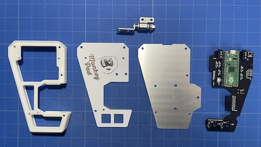

Since the design is fully symmetrical and reversible, decide whether to have the aluminum side of the top plate face outward or the white & logo side face outward.

*Note:* The aluminum side does not have any surface coating and is prone to scratches. If necessary, apply a coating. We also provide spare parts for replacements.

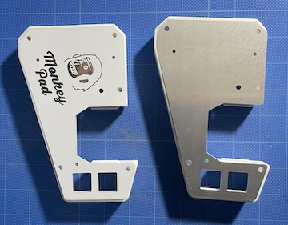

The photo shows an example of assembling with the white side facing outward.

Attach the [22] **Torque Hinges** to the main body using [41] **M3 Hex Nuts** inserted into the opposite nut pockets, and temporarily secure them with [38] **M3 x 12mm Low-Profile Screws**.

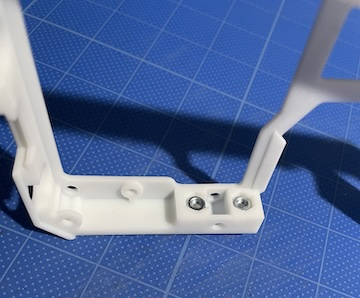

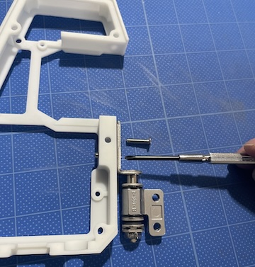

Insert **5** [36] **Hex Double Male Threaded Standoffs** into the pockets as shown in the photo. Attach the [6] **Main Top Plate** using [37] **M3 x 6mm Low-Profile Screws**.

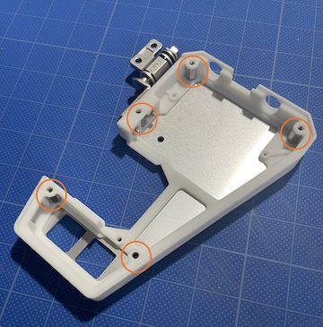

Attach the side with the ribs to the top plate side. Secure the top plate and main PCB by sandwiching the ribs.

Secure the main PCB using [39] **M2 x 8mm Screws** and **Nuts**.

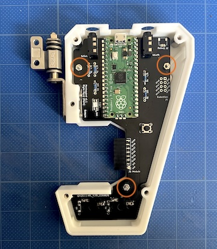

Attach the [7] **Main Bottom Plate** using [37] **M3 x 6mm Low-Profile Screws**.

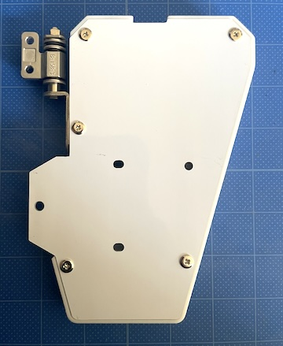

The torque hinges are adjustable in hardness. Adjust the tightness of the hex nuts using a wrench to change the hardness. Do not overtighten.

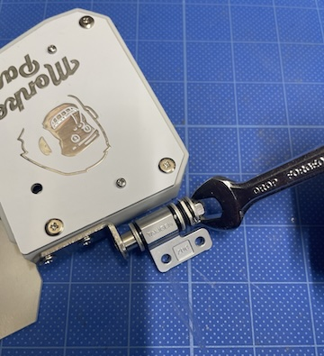

### 10-2. Attaching the Tripod Adapter

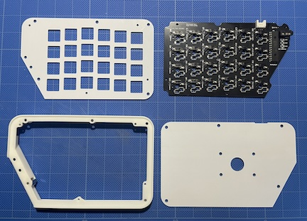

Secure the [46] Tripod Adapters to the sub-board's bottom plate using [40] M3 x 6mm Low-Profile Screws** and [41] M3 Nuts. Alternatively, you can attach [45] Grommets instead of Tripod Adapters. Use whichever you prefer.

**If attaching the Tripod Adapter:**

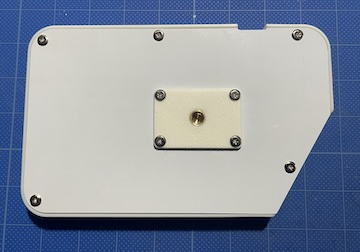

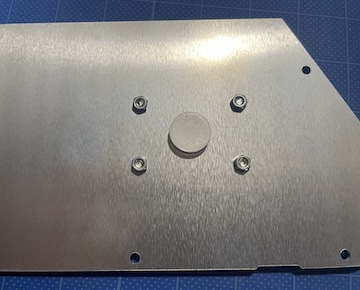

**If attaching the Grommet:**

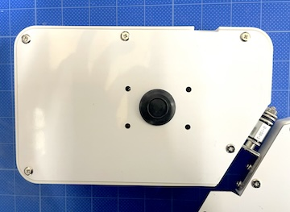

### 10-3. Assembling the Sub-Board

#### [If attaching low-profile sockets to the sub-board, click here](../low_profile/10_Assembly_Low_Profile.md)

Secure the [11] Sub Body and [8] Sub Top Plate. Insert 5 Hex Double Male Threaded Standoffs into the sub body's pockets and attach the top plate using [37] M3 x 6mm Low-Profile Screws. Attach the side with ribs to the top plate side as shown in the photo.

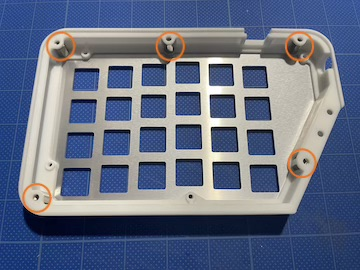

Secure the sub-board PCB using [39] M2 Screws and [42] M2 Nuts at 4 locations.

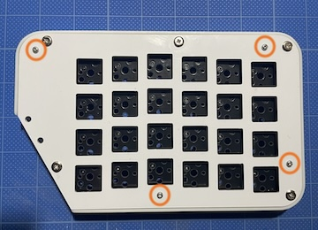

Ensure that the legs of the IO Expander, Jacks, and Connectors on the PCB do not touch the top plate by trimming any excess length with wire cutters.

*(Contact may alter resistance values, potentially causing malfunctions.)*

Attach the [9] Sub Bottom Plate to the Sub Body using [6] M3 x 6mm Low-Profile Screws.

Finally, secure the torque hinges. Insert [38] **M3 x 12mm Low-Profile Screws** under the nut pockets and secure them.

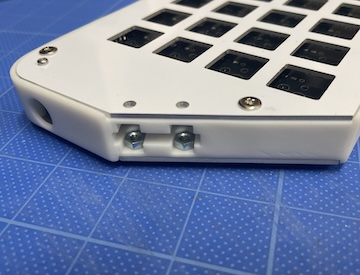

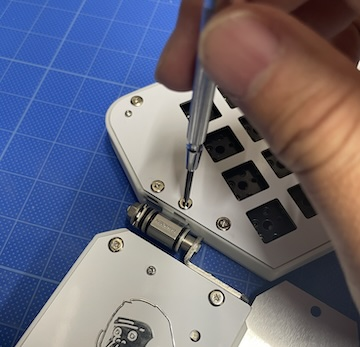

Adjust the position and hardness of the torque hinges to ensure they do not collide when moved at 90 degrees.

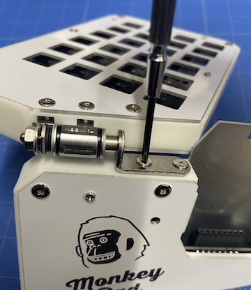

Assemble the other side in the same way.

### 10-4. Attaching the Rubber Pads

Attach the [44] Rubber Pads at the following positions to complete the assembly.

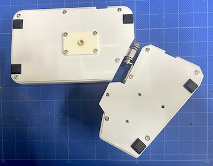

Attach your preferred key switches and keycaps.

**Good job!**

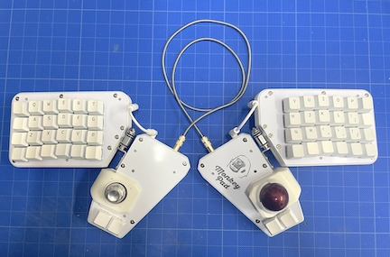

- [Next (11_Final_Finishing)](11_Complete.md)
