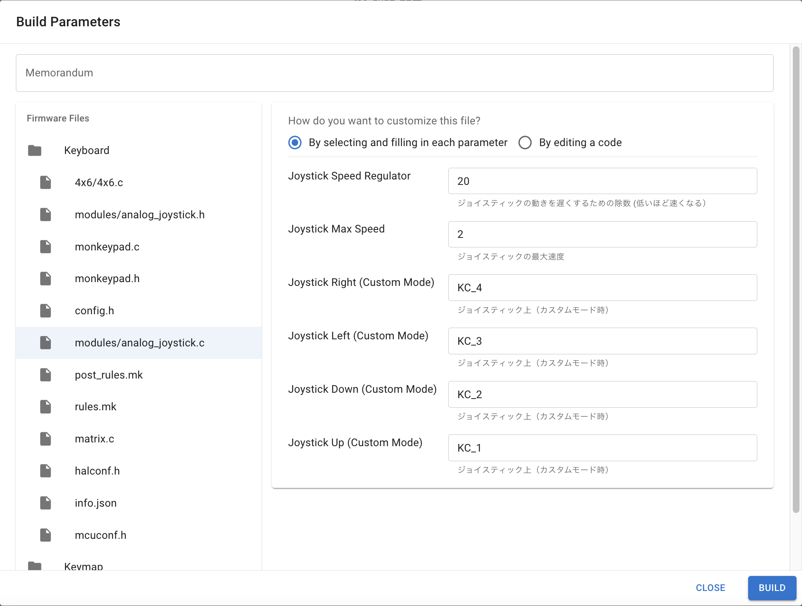

<!-- ### Monkeypad Build Guide Top Page is here [English](01_build_guide.md)  -->

- [A01. Changing the Keymap (Remap)](A01_Changing_Keymap_Remap.md)
  - [A01-1. Changing the Keymap (Remap)](#A01-1-changing-the-keymap)
  - [A01-2. For Deeper Customization](#A01-2-for-deeper-customization)

### A01-1. Changing the Keymap (Remap)

You can download the default keymap from the link below.

[Default Keymap](../images/keymap_cheatsheet_monkeypad.pdf)

The MonkeyPad supports [Remap](https://salicylic-acid3.hatenablog.com/entry/remap-manual). You can customize the firmware and change the keymap without installing any special software. If you want to make changes using VIA, refer to the next section [A02_Changing the Keymap with VIA](A02_Changing_Keymap_VIA.md).

For detailed instructions on how to use Remap, refer to [Salicylic Acid3's article on Remap in the Monkeypad Guide](https://salicylic-acid3.hatenablog.com/entry/remap-manual).

Select the Layout Option.


Select from the dropdown according to the modules you have installed.


After arranging the keymap to your preferred layout, press the flash button to apply the changes.


### A01-2. For Deeper Customization

**If you want to build the firmware yourself**

All of Monkeypad's latest firmware is available in the GitHub repository. There are two ways to build firmware from the source:

[Monkeypad (GitHub)](https://github.com/monkeypad/monkeypad/tree/main/qmk_firmware/keyboards/monkeypad/monkeypad)

**Method 1: Remap**

Remap not only allows you to change the keymap but also added a firmware build feature as a new function (2023/11~). You can build the firmware from the source code without setting up a local QMK development environment. For details, refer to the user-oriented features explained in [Yoichiro-san's article on Remap Firmware Building](https://www.eisbahn.jp/yoichiro/2023/11/remap_building_firmware.html#gsc.tab=0).

From the Remap homepage, select [FIND A KEYBOARD] and search for [Monkeypad_Mk1] on the search screen.

Select the BUILD tab and press the [BUILD FIRMWARE] button.


The Build Parameters screen will open.

**Important:**

The Monkeypad allows users to swap multiple modules for different applications and needs.

However, QMK (version: 0.23.0) currently does not natively support multiple different types of pointing devices or sensors.

If you are using different pointing devices on the left and right (e.g., analog_joystick / pmw3389), you need separate firmware for each side and must build twice, specifying the target pointing device each time. If you are using encoders or the same type of pointing devices on both sides (e.g., both sides trackballs), you can use the same firmware for both left and right.

Before building the firmware, ensure that the modules are specified in `rules.mk`.


In `keymap.c`, you can change the modes for the trackball and analog joystick.


| Trackball Mode    | Description                                    |
|-------------------|------------------------------------------------|
| BALL_MOUSE_MODE   | Move the cursor like a mouse.                  |
| BALL_SCROLL_MODE  | Scroll the screen.                             |

| Joystick Mode        | Description                                                                                     |
|-----------------------|-------------------------------------------------------------------------------------------------|
| JOYSTICK_MOUSE_MODE   | Move the cursor like a mouse.                                                                   |
| JOYSTICK_WHEEL_MODE   | Send keycodes for mouse wheel: Wheel Up (KC_WH_U), Wheel Down (KC_WH_D), Wheel Left (KC_WH_L), Wheel Right (KC_WH_R) |
| JOYSTICK_ARROW_MODE   | Send keycodes for arrow keys: Up (KC_UP), Down (KC_DOWN), Left (KC_LEFT), Right (KC_RIGHT)     |
| JOYSTICK_GAME_MODE    | Send keycodes for WASD keys (used for movement in games): W (KC_W), A (KC_A), S (KC_S), D (KC_D) |
| JOYSTICK_CUSTOM_MODE  | Send keycodes defined by the user in `analog_joystick.c`.                                      |

Additionally, in `config.h`, you can reverse the direction of the trackball's scroll mode and the analog joystick's wheel mode.

In `modules/analog_joystick.c`, you can change the speed of the analog joystick and set keycodes for the custom mode. The default settings are [1,2,3,4].



After configuring the settings, press the BUILD button to build the firmware. Download and flash it.

**Method 2: QMK**

*For Advanced Users*

You can also build the firmware locally by setting up a QMK build environment and building from [Monkeypad's source code](https://github.com/monkeypad/monkeypad/tree/main/qmk_firmware/keyboards/monkeypad/monkeypad).

Clone the Monkeypad folder from GitHub into your QMK_Firmware/keyboards directory and freely edit the keymap and other configurations. Please read the README inside the directory for more details.

QMK does not support drivers for different pointing devices on the left and right sides. *(As of 2024/01)*

If you are using different pointing devices on the left and right (analog_joystick / pmw3389), you need to select the target pointing device and compile twice, once for each side.

*(If you are using the same pointing devices on both sides or using encoders, you can use the same firmware for both sides.)*

When customizing the keyboard from code in QMK, in `keyboards/monkeypad/monkeypad/4x6/mk1/rules.mk`, specify both the combination of pointing devices and the pointing device to be written.

For example: If the left is a joystick and the right is a trackball (pmw3389), specify as follows:

Please select `Module type := analog_joystick / pmw3389 / encoder`

`pmw3389` = trackball sensor

```c
MODULE_DEVICE_LEFT = analog_joystick
MODULE_DEVICE_RIGHT = pmw3389
