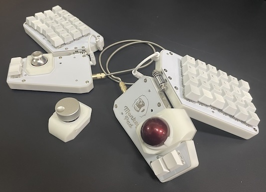
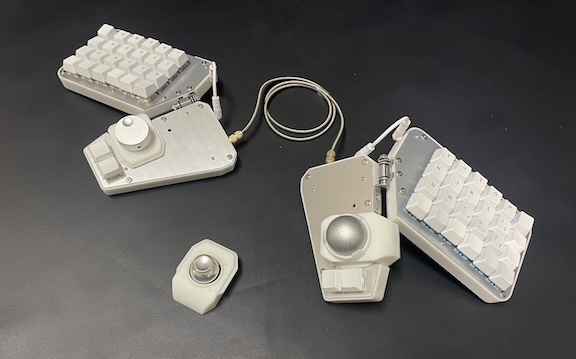
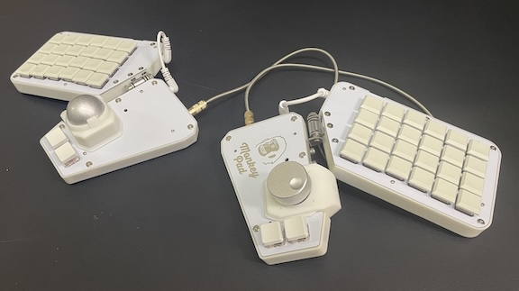
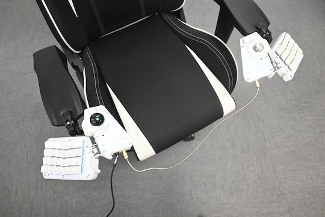
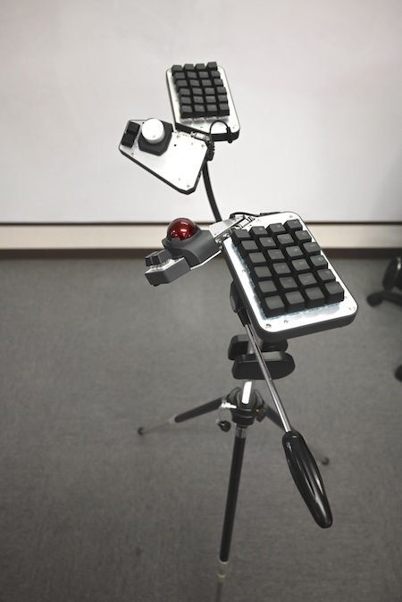

### Customization

The Monkeypad is not a finished product right after assembly; it can be customized after building. By installing separately sold low-profile key switches and key sockets, you can use thin keycaps.

Additionally, you can change its appearance using the reversible top plate.

By attaching the tripod adapters below, you can combine the Monkeypad with commercially available tripods to type in various postures, as shown below.

We plan to develop additional modules in the future.

Furthermore, since the sub-board is equipped with I2C ports and the PCB board has expansion ports, feel free to enjoy customizing your Monkeypad!
