<!-- ### Monkeypad Build Guide Top Page is here [English](01_build_guide.md)  -->

- [B. Assembling the Trackpad Module](B01_trackpad_TM035035.md)
  - [B-1. Parts Used](./B01_trackpad_TM035035.md/#b-1Components)
  - [B-2. Soldering PMW3389 Components](./B01_trackpad_TM035035.md/#b-2Soldering-PMW3389-Components)
  - [B-3. Assembling the Trackpad Module](./B01_trackpad_TM035035.md/#b-3Assembling-the-Trackpad-Module)  

### B-1. Components

This section covers assembling the optional trackpad module.
We use the Cirque-manufactured trackpad module (TM035035-2024-003). To connect the SPI communication (12-pin) to the Monkeypad module, connect via a conversion board.

| No | Name | Quantity | Notes |
|:-:|:---|:---:|:---:|
| 71 | Trackpad Conversion Board | 1 pc | |
| 72 | Trackpad Cover (Bottom) | 1 pc | |
| 73 | Trackpad Cover (Top) | 1 pc | |
| 74 | FFC/FPC Flat Cable | 1 pc | |
| 28 | 8-Pin L-Shaped Pin Header | 1 pc | |
| 76 | Self-Tapping Screw M2 x 6mm | 8 pcs | |
| 77 | Trackpad (TM035035-2024-003) | 1 pc | |

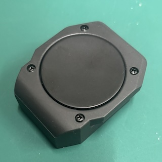
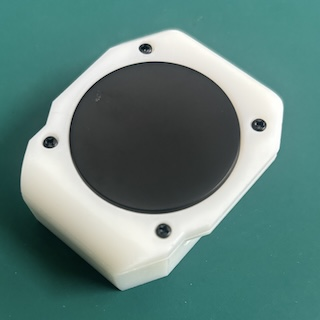

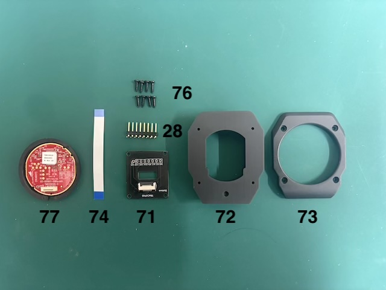

### B-2. Soldering PMW3389 Components

For soldering the trackpad components, solder the [28] 8-Pin L-Shaped Pin Header.

***Important***
Refer to the photos and pay attention to the orientation.

Fix the [28] 8-Pin L-Shaped Pin Header on the "BOTTOM" side and solder the backside so that it sits horizontally.

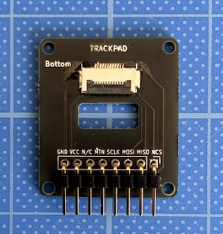 

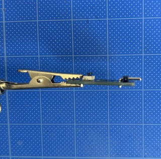  

### B-3. Assembling the Trackpad Module

Raise the clips on the [74] connector part and connect the FFC/FPC flat cable so that the blue side is on top and the pins are at the bottom.

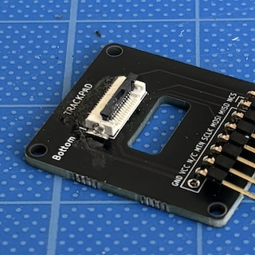  

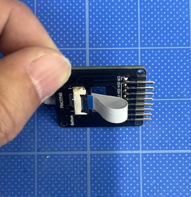  

Next, insert the [77] Trackpad (TM035035-2024-003) into the Trackpad Cover (Top) [73]. Insert the trackpad so that the notched areas align as shown in the figure.

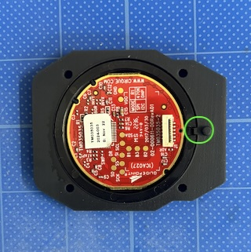  

Securing the trackpad with masking tape helps prevent the components from shifting.

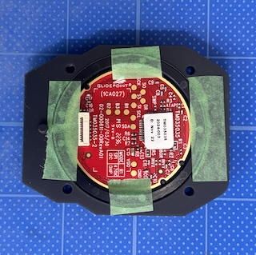  

Align the pins of the trackpad and [73] Trackpad Cover (Top) with [72] Trackpad Cover (Bottom) and overlay them.

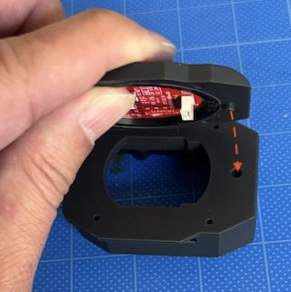  

Fix the Trackpad Cover with [76] M2 self-tapping screws.

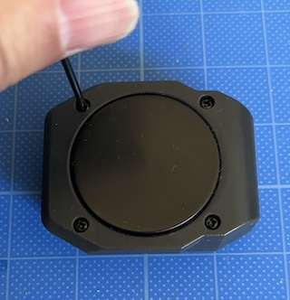  

Connect the cable to the trackpad, paying attention to the orientation.

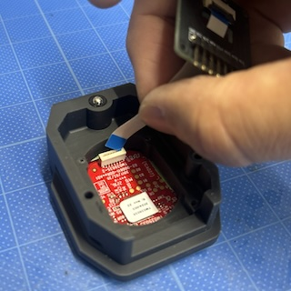  

Fix the conversion board with M2 self-tapping screws.

  

The Trackpad Module is now complete.

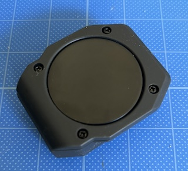  
