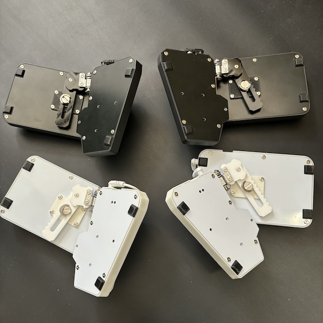
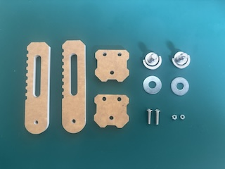
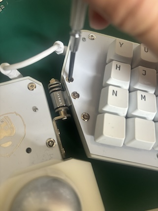
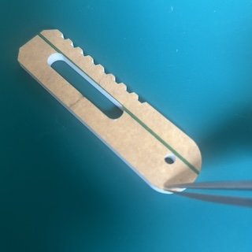
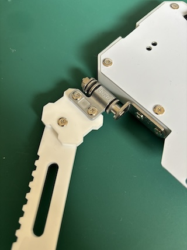
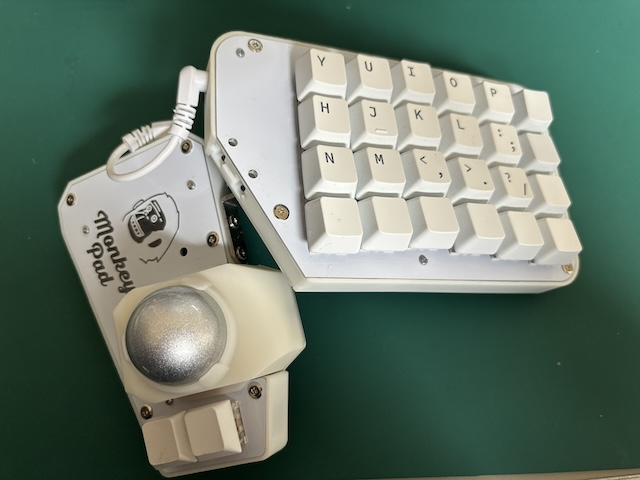

<!-- ### Monkeypad Build Guide Top Page is here [English](01_build_guide.md)  -->

- [B. Assembling the Adjustable Link](B02_Adjustable_Link.md)
  - [B-1. Parts Used](./B02_Adjustable_Link.md/#b-1Components)
  - [B-2. Assembling the Adjustable Link](./B02_Adjustable_Link.md/#b-2Assembling-the-Adjustable-Link)  

### B-1. Components

This section covers assembling the optional adjustable link.

| No | Name | Quantity | Notes |
|:-:|:---|:---:|:---:|
| 81 | 1/4-Inch Screw | 2 pcs | |
| 82 | Link (Short) | 2 pcs | |
| 83 | Link (Long) | 2 pcs | |
| 84 | Washer | 2 pcs | |
| 38 | Low-Profile Screw M3 x 12mm | 2 pcs | |
| 41 | Hex Nut M3 | 2 pcs | |

### B-2. Assembling the Adjustable Link

Remove the two M3 screws from the torque hinges as shown in the figure. Be careful not to lose the removed screws and nuts as they will be reused.

Remove the protective sheet from the acrylic surface.

 

Fix the [82] Link (Short) and [83] Link (Long) using [38] M3 low-profile screws and [41] M3 nuts.

  

Fix the [82] Link (Short) and torque hinge using [38] M3 low-profile screws and [41] M3 nuts.

  

Insert [84] Washers.

  

Pay attention to the direction as you stack them according to the diagram.

  

Adjust to your preferred position and angle, then fix with 1/4-Inch screws. Assemble the other side in the same way.

  
