- [7. Assembling the Sub-Board (Left/Right)](07_sub_pcb_board_low_profile.md)
  - [7-1. Parts Used](./07_sub_pcb_board_low_profile.md/#7-1Components)
  - [7-2. Soldering Sub-Board Components](./07_sub_pcb_board_low_profile.md/#7-2Soldering-Sub-Board-Components)
  - [7-3. Adding Low-Profile Key Switches to the Standard Kit](./07_sub_pcb_board_low_profile.md/#7-3Adding-Low-Profile-Key-Switches-to-the-Standard-Kit)

## This Page is for When You Have Attached Optional Low-Profile Key Sockets

### 7-1.Components

The following parts are used per side. Since they are symmetrical for left and right, assemble the opposite side in the same manner.

| No | Name | Quantity |
|:-:|:---|:---:|
| 2 | Sub PCB Board (Left/Right) | 1 pc |
| 8 | Sub Top Plate (Left/Right) | 1 pc |
| 9 | Sub Bottom Plate (Left/Right) | 1 pc |
| 11 | Sub Body (Left/Right) | 1 pc |
| 23 | IO Expander (MCP23017) | 2 pcs |
| 26 | TRRS Jack | 1 pc |
| 31 | Grove Connector | 1 pc |
| 33 | Diode (SMD) | 24 pcs |
| 49 | Kailh Key Switch Socket (Low-Profile) | 24 pcs |

### 7-2.Soldering Sub-Board Components

All component installations are done on the underside where the component names are silk-screened.

Solder the [33] Diodes, 24 per side. Pay attention to the orientation. The square through-hole side is the cathode side (marked with lines).

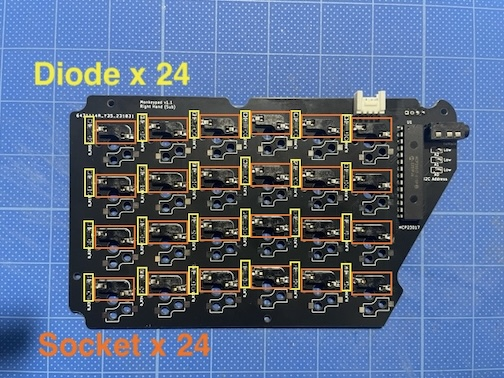

Next, install the low-profile [49] Kailh PCB Socket choc for the key switches as shown in the photo, 24 per side. It is also fine to install both standard MX key sockets and low-profile sockets.

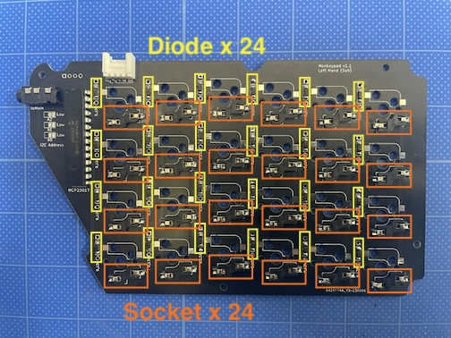

Solder the [23] IO Expanders. Install them aligning the notch direction with the silk screen.

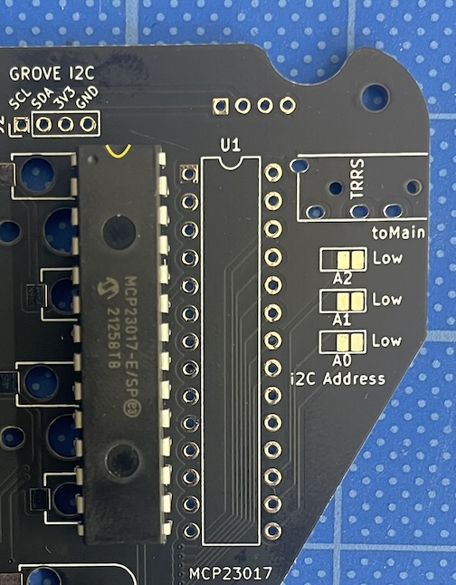

The pins are slightly spread apart and difficult to insert, so gently press with your hand or on the table to align them with the through-holes.

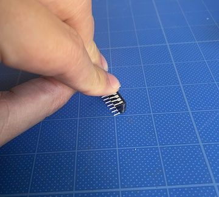

Before soldering, ensure all pins are sticking out from the through-holes.

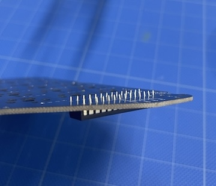

Fix the [26] TRRS Jack with masking tape or similar to make the work easier.

Install the [31] GROVE Connector, which is an I2C expansion connector. Be careful not to insert into the nearby 4-pin 2mm pitch through-holes by mistake.

Install the GROVE Connector on the pad labeled "GROVE I2C" with the top facing up.

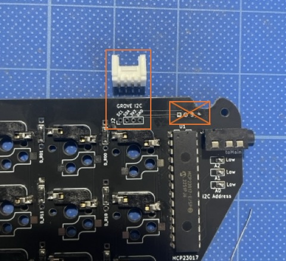

After soldering, trim the protruding pins of the IO Expander, TRRS Jack, and GROVE Connector with wire cutters.

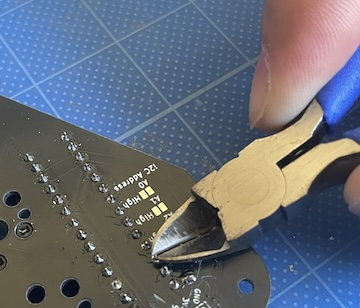

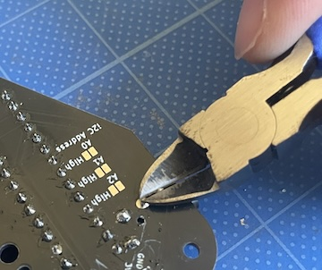

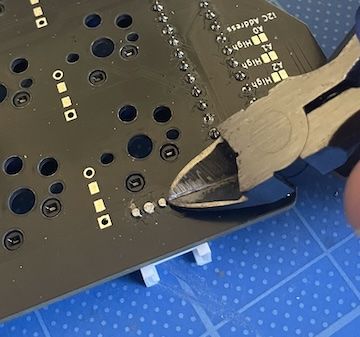

Solder the I2C Address solder jumper by pouring solder to short them. This specifies the I2C address of the IO Expander. Short A0, A1, and A2 all to Low.

Heat the pads with the soldering iron tip and melt the solder to bridge them.

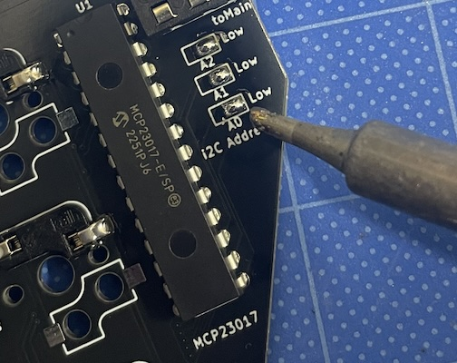

**Note:** If you want to change the I2C address, there is a High on the opposite side. Do not short Low and High simultaneously, and do not connect to power, as it may cause damage. If you change it, you also need to modify the source code and firmware accordingly.

The sub-board is now complete.

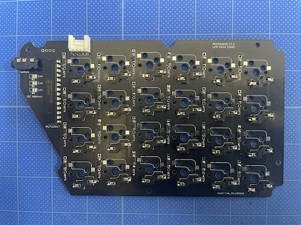

Assemble the opposite side in the same manner.

### 7-3.Adding Low-Profile Key Switches to the Standard Kit

If you have already assembled the standard kit and wish to change it to low-profile specifications, add the separately sold low-profile [49] Kailh PCB Socket choc as shown in the photo, 24 per side. It is also fine to have both standard and low-profile key sockets installed.

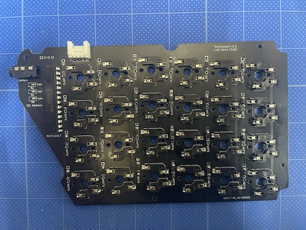

- [Next (08_Main Board Assembly)](../08_main_pcb_board.md)
