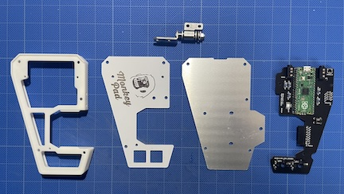
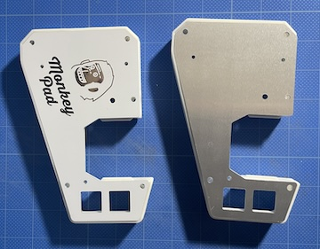
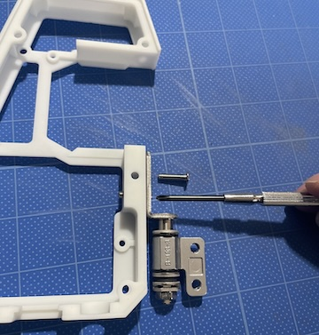
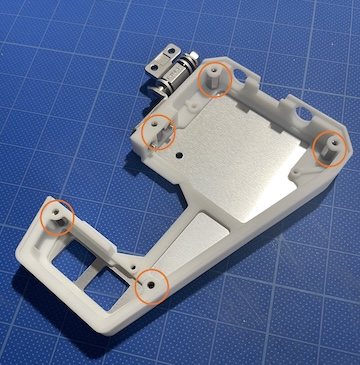
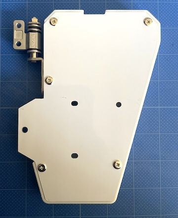
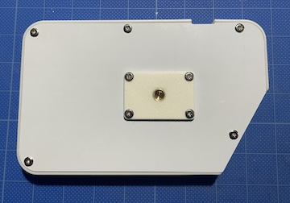
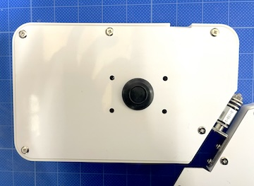
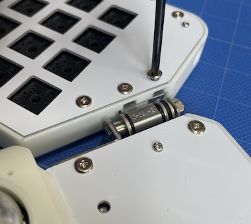

- [10. Assembly](10_Assembly.md)
  - [10-1. Assembling the Main Board](#10-1Assembling-the-Main-Board)
  - [10-2. Attaching the Tripod Adapter](#10-2Attaching-the-Tripod-Adapter)
  - [10-3. Assembling the Sub-Board](#10-3Assembling-the-Sub-Board)
  - [10-4. Attaching the Rubber Pads](#10-4Attaching-the-Rubber-Pads)

### 10-1.Assembling the Main Board

Since the design is fully symmetrical and reversible, decide whether to have the aluminum side of the top plate facing out or the white & logo side facing out.
*Note:* The aluminum side has no surface coating, so it can be easily scratched. If needed, apply a protective coating. Spare parts for replacement are also available.

The photos show an example of assembling with the white side facing out.

Fix the [22] torque hinges to the main body. Insert the [41] M3 hex nuts into the opposite nut pockets and temporarily secure with [38] M3 low-profile screws 12mm.

Insert five [36] hex double male screws into the pockets as shown in the photo. Attach the [6] main top plate with [37] M3 low-profile screws 6mm.

Attach to the side with the ribs as shown in the photo. Secure the top plate and main PCB by sandwiching the ribs.

Secure the main PCB with [39] M2 screws 10mm and nuts.

Attach the [7] main bottom plate with [37] M3 low-profile screws 6mm.

Torque hinges are adjustable hinges. Adjust the tightness with a wrench to change the stiffness.

### 10-2.Attaching the Tripod Adapter

Attach the [46] tripod adapter to the sub-board's bottom plate using [37] M3 low-profile screws 6mm and [41] M3 nuts.
Alternatively, you can attach [45] grommets instead of the tripod adapter. Use whichever you prefer.

When attaching the tripod adapter:

When attaching the grommet:

### 10-3.Assembling the Sub-Board

### If You Have Installed Standard Key Sockets, Refer Here ([../standard/10_Assembly_Low_Profile.md](../standard/10_Assembly_Low_Profile.md))

Fix the [8] sub top plate and sub PCB board. Insert [43] spacers for low-profile between them and secure with [39] M2 screws 10mm and [42] M2 nuts.

Ensure that the IO Expanders, TRRS Jacks, and Grove Connectors' pins on the PCB board do not touch the top plate by trimming any excess cable length with wire cutters. (Contact may change resistor values and cause malfunctions.)

Fix the [11] sub body and [9] sub bottom plate. Insert five [36] hex double male screws into the sub body's pockets and secure the top plate with [37] M3 low-profile screws 6mm.
Attach to the side with the ribs as shown in the photo.

Fix the [11] sub body, [8] sub top plate, and sub PCB board. Secure the top plate with [37] M3 low-profile screws 6mm.

Finally, secure the torque hinges. Insert [41] M3 hex nuts into the bottom of the nut pocket and tighten with [38] M3 low-profile screws 12mm.

Adjust the torque hinge's position and stiffness to prevent collisions when moving it 90 degrees as shown in the photo.

Assemble the opposite side in the same manner.

### 10-4.Attaching the Rubber Pads

Attach [44] rubber cushion pads to the following locations to complete the assembly.

![Attaching Rubber Pads](../../images/10/mon
