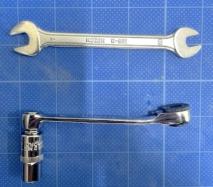

<!-- ### Monkeypad Build Guide Top Page is here [English](01_build_guide.md)  -->

  - [2. 準備](02_準備.md)
    - [2-1. 必要な工具](./02_準備.md/#2-1必要な工具)

## 2.準備
### 2-1.必要な工具

自作キーボードに関する知識、経験、道具をお持ちの方はスキップして[アナログジョイスティックの組み立てへ](04_ジョイスティック.md) 

はんだ付けに慣れていない方は融点が低い200度程度のはんだ、温度が高くなりすぎないように270度程度に温度調節ができるはんだごてがおすすめです。

| No | Monkeypadの組み立てに必要な工具 |
|:-|:-|
| 1 | はんだごて(温度調整可能なものがおすすめ) ,はんだこて台 |
| 2 | はんだ(融点が低い鉛入りはんだが作業しやすい) |
| 3 | 精密プラスドライバー |
| 4 | ピンセット |
| 5 | ニッパー |
| 6 | ラジオペンチ |

### あると作業しやすいもの

また必須ではありませんが、以下の工具はあると便利です。

マスキングテープは、部品が浮かないように部品の仮止めに使用します。

はんだづけに失敗した場合に、はんだ吸取器かはんだ吸取線があるとよいです。

キーが正しく反応しているか、ダイオードの向きの確認、抵抗値のチェックなどにテスターがあると便利です。

7mm レンチはトルクヒンジの硬さを調整するために使います。ラジオペンチでも代用できますが傷がつくのを防止できます。

| No | あると作業しやすい工具 |
|:-|:-|
| 8 | はんだ吸取器、または、はんだ吸取線 |
| 9 | マスキングテープ |
| 10 | テスター |
| 11 | 7mm ソケットレンチ、または7mmスパナ |
| 12 | 作業皿（細かい部品を入れる器） |

  - [次へ(03_はんだ付け)](03_はんだ付け.md)
