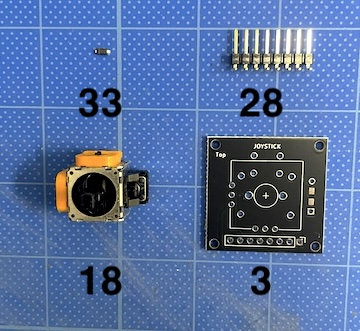
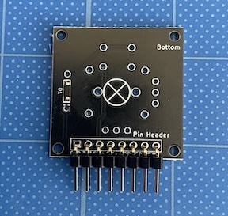
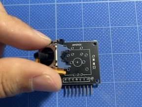

### Monkeypad Build Guide Top Page is here [English](01_build_guide.md)

## 4,5,6．モジュール基板の実装

     

  - [4. ジョイスティックの組み立て](04_ジョイスティック.md)  
    - [4-1. 使用する部品](./04_ジョイスティック.md/#4-1使用する部品)
    - [4-2. ジョイスティック部品のはんだ付け](./04_ジョイスティック.md/#4-2ジョイスティック部品のはんだ付け)
    - [4-3. ジョイスティックモジュールの組み立て](./04_ジョイスティック.md/#4-3ジョイスティックモジュールの組み立て)

### 4-1．使用する部品

| No | 名前 | 数 |
|:-|:-|:-|
|  3 | ジョイスティックPCB基板 | 1個 |
| 18 | ジョイスティック | 1個 |
| 28 | ピンヘッダ8ピンL型 | 1個 |
| 33 | ダイオード(SMD) | 1個 |

| No | 名前 | 数 |
|:-|:-|:-|
| 13 | ジョイスティックカバー | 1個 |
| 19 | ジョイスティックサムスティック | 1個 |
| 40 | タッピングネジ M2 x 5mm | 4個 |

### 4-2．ジョイスティック部品のはんだ付け

それでは、はんだ付けをはじめてみましょう。
[18]ジョイスティックは[3]ジョイスティックPCB基板の表（Top）側に実装します。ジョイスティック以外のダイオードとピンヘッダは裏（Bottom）側に実装されます。はんだ付けする面は表裏両側になります。注意してください。
まずBottom側の図の黄色い場所に[33]ダイオードを1個取り付けます。ダイオードの向きに注意してください。

次に、ダイオードと同じBottom面にL型の(28)ピンヘッダを取り付け、反対側(Top側)をはんだ付けします。

**重要:**
L型ピンヘッダは`Pin Header`とシルク印刷されている側に水平に取り付けます。写真を見て方向に注意してください（高くならないように）。水平に取り付くように1〜2ピンをはんだでまず仮止めして水平であることを確認し、すべてのピンをはんだ付けしてください。

次に、反対側のTop面にジョイスティックを取り付けます。`×`印が付いている面ではなく、`+`字のマークのある面にジョイスティックをのせてください。

ジョイスティックが傾かないように注意しながら、マスキングテープで固定するか、手で支えながら反対側の全てのピンにはんだを流し込みます。

ジョイスティック基板の完成です。

### 4-3.ジョイスティックモジュールの組み立て

M2タッピングビスでモジュールをケースに固定します。

サムスティックを奥まで押し込み、ジョイスティックモジュールの完成です。

  - [次へ(05_エンコーダ)](05_エンコーダ.md)
