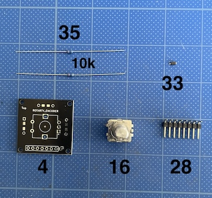
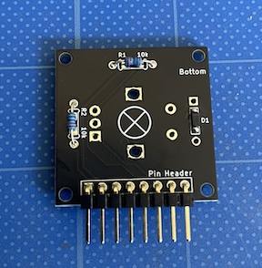
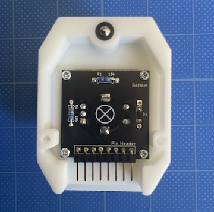
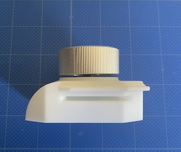
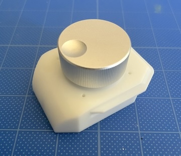

### Monkeypad Build Guide Top Page is here [English](01_build_guide.md)

  - [5. エンコーダの組み立て](05_エンコーダ.md)
    - [5-1. 使用する部品](./05_エンコーダ.md/#5-1使用する部品)
    - [5-2. エンコーダ部品のはんだ付け](./05_エンコーダ.md/#5-2エンコーダ部品のはんだ付け)
    - [5-3. エンコーダモジュールの組み立て](./05_エンコーダ.md/#5-3エンコーダモジュールの組み立て)

### 5-1．使用する部品

| No | 名前 | 数 |
|:-|:-|:-|
|  4 | エンコーダPCB基板 | 1個 |
| 16 | エンコーダ | 1個 |
| 28 | ピンヘッダ8ピンL型 | 1個 |
| 33 | ダイオード(SMD) | 1個 |
| 35 | 抵抗(10k) | 2個 |

| No | 名前 | 数 |
|:-|:-|:-|
| 13 | エンコーダカバー | 1個 |
| 17 | エンコーダノブ | 1個 |
| 40 | タッピングネジ M2 x 5mm | 4個 |

### 5-2．エンコーダ部品のはんだ付け

ジョイスティックと同じように[33]ダイオード1個と[28]ピンヘッダを[4]エンコーダPCB基板の裏（Bottom）側に取り付けます。
ダイオードの向きに注意してください。

**重要:**
ピンヘッダは`Pin Header`とシルク印刷されている側に水平に取り付けます。1〜2ピンをはんだでまず仮止めして水平であることを確認し、すべてのピンをはんだ付けしてください。

次に[35]10kΩの抵抗を同じく裏（Bottom）側に２個取り付けます。抵抗に向きはありません。

反対側にはんだ付けします。はみ出している足をニッパーで切ります。

反対側の`ROTARY ENCODER`とあるTop面に[16]ロータリーエンコーダを取り付けます。`×`印が付いている面ではなく、`+`字のマークのある面にエンコーダをのせてください。

ロータリーエンコーダが傾かないように注意しながら、マスキングテープで固定するか、手で支えながら反対側の全てのピンにはんだを流し込みます。

エンコーダ基板の完成です。

### 5-3．エンコーダモジュールの組み立て

[40]M2タッピングビスでモジュールを[13]エンコーダカバーに固定します。

[17]エンコーダノブを差し込みます。シャフトの平面取りがしてある面に止めネジが来るように六角レンチで止めます。

エンコーダは上から押すことができるスイッチ付きになっています。

ノブを完全に奥まで差し込まず、上から押した時にクリックできる位置で（2mmほど隙間を開けて）止めネジを固定してください。

エンコーダモジュールの完成です。

  - [次へ(06_トラックボール_PMW3389)](06_トラックボール_PMW3389.md)
