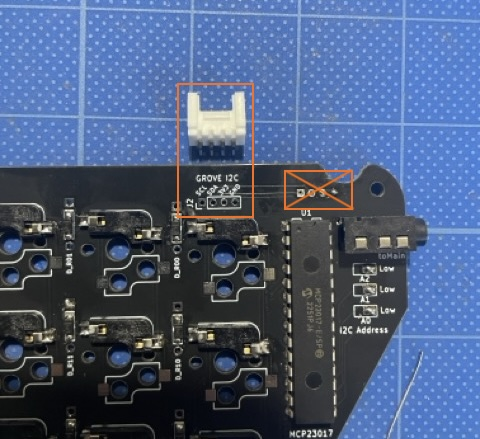

### Monkeypad Build Guide Top Page is here [English](01_build_guide.md)

  - [7. サブボードの組み立て（左/右）](07_サブボード.md)
    - [7-1. 使用する部品](./07_サブボード.md/#7-1使用する部品)
    - [7-2. サブボード部品のはんだ付け](./07_サブボード.md/#7-2サブボード部品のはんだ付け)

### 7-1．使用する部品

片側１枚あたり以下の部品を使用します。反対側も左右対称で同様に組み立てます。

| No | 名前 | 数 |
|:-|:-|:-|
|  2 | サブPCB基板(左/右) | 1枚 |
|  8 | サブトッププレート(左/右) | 1枚 |
|  9 | サブボトムプレート(左/右) | 1枚 |
| 11 | サブボディ(左/右) | 1個 |
| 23 | IOエキスパンダ(MCP23017) | 2個 | |
| 26 | TRRSジャック | 1個 |
| 31 | Groveコネクタ | 1個 |
| 32 | Kailh キースイッチソケット | 24個 |
| 33 | ダイオード(SMD) | 24個 |

### 7-2．サブボード部品のはんだ付け

部品の実装は全て部品名がシルク印刷されてある裏面になります。
写真のように[33]ダイオードを片側に24個取り付けます。向きに注意してください。四角のスルーホール側がカソード側（線が印字されている方）です。

キースイッチの[32]ソケットを片側24個取り付けていきます。

[23]IOエキスパンダをはんだ付けします。ICの切り欠きの方向をシルク印刷に合わせて取り付けてください。

少しピンが開いていて入れづらいので、手や机で軽く押してスルーホールに合わせてください。

はんだ付けをする前に全ての足がスルーホールから出ているか確認してください。

[26]TRRSジャックを取り付けます。TRRSジャックをマスキングテープなどで固定すると作業しやすくなります。

I2Cの拡張コネクタである[31]GROVEコネクタを取り付けます。***重要*** 2mmピッチの4ピンのスルーホールが近くにありますので場所を間違えないように注意してください。

GROVE I2Cと印刷されているパッドに上向きに取り付けます。

はんだ付けした後、はみ出しているIOエキスパンダ、TRRSジャック、GROVEコネクタの足をニッパーで切ります。

I2C Addressのソルダージャンパーをはんだを流し込んでショートさせます。これは、IOエキスパンダのI2Cアドレスを外部から指定するものです。A0, A1, A2をすべてLow側にショートさせます。

パッドをこて先で温めてから、はんだを溶かすとブリッジできます。

※ （上級者向け）I2Cアドレスを変更したい場合は反対側の面にHighがあります。Lowと表面のHighの両方を同時にショートさせて、電源に接続しないでください。故障する可能性があります。変更する場合はソースコード、ファームウェアもあわせて変更する必要があります。

サブボードの完成です。

反対側も同様に実装します。

  - [次へ(08_メインボードの実装)](08_メインボード.md)

オプションでロープロファイルに変更したい場合はこちら

  - [ロープロファイルキースイッチを標準キットに追加する場合](./07_サブボード.md/#7-3ロープロファイルキースイッチを標準キットに追加する場合)
