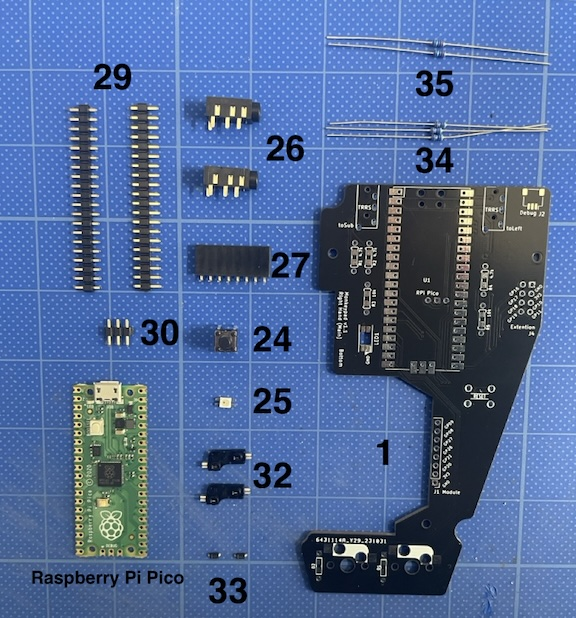
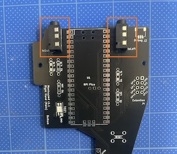
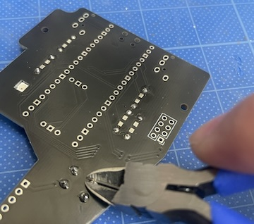
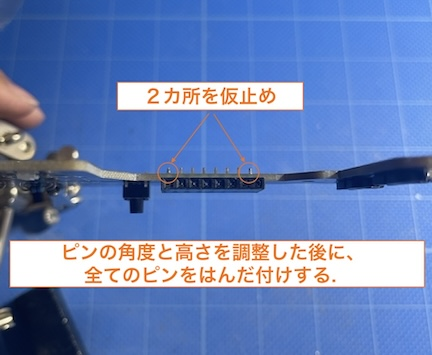
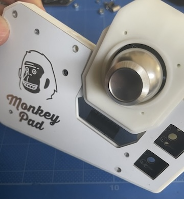
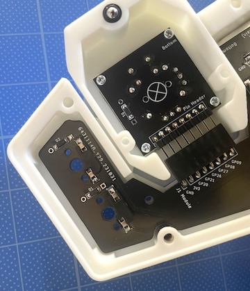
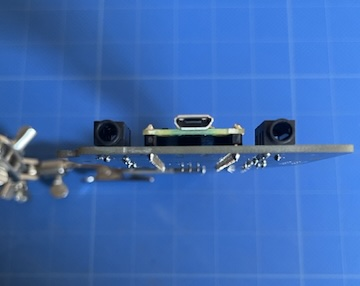

### Monkeypad Build Guide Top Page is here [English](01_build_guide.md)）

  - [8. メインボードの組み立て（左/右）](08_メインボード.md)
    - [8-1. 使用する部品](./08_メインボード.md/#8-1使用する部品)
    - [8-2. メインボード部品のはんだ付け](./08_メインボード.md/#8-2メインボード部品のはんだ付け)

### 8-1．使用する部品

片側１枚あたり以下の部品を使用します。左右対称ですので反対側も同じように必要です。

| No | 名前 | 数 | 備考 |
|:-|:-|:-|:-|
|  1 | メインPCB基板(左/右) | 1枚 ||
| 24 | タクトスイッチ | 1個 ||
| 25 | LED(SK6812MINI-E) | 1個 ||
| 26 | TRRSジャック | 2個 ||
| 27 | ピンソケット8ピンL型 | 1個 ||
| 29 | ピンヘッダ20ピン | 2個 ||
| 30 | ピンヘッダ3ピン | 1個 ||
| 32 | Kailh キースイッチソケット | 2個 ||
| 33 | ダイオード(SMD) | 2個 ||
| 34 | 抵抗(4.7k) | 3個 ||
| 35 | 抵抗(10k) | 2個 ||
| - | Raspberry Pi Pico | キットに含まれていません ||

### 8-2．メインボード部品のはんだ付け

部品の実装は全て部品名がシルク印刷されてある裏面になります。
[33]ダイオードと[32]キーソケットを2個ずつ取り付けます。

[25]LEDを取り付けます。LEDの発光面を向こう向きにして、切り欠き（GND）とシルク印刷の位置が合うように位置に注意してはんだ付けします。LEDは高温で長時間はんだを当てすぎないように注意してください。

[26]TRRSジャックを2個取り付けます。

[24]タクトスイッチを取り付けます。写真の足の向きに注意して、はんだ付けします。

抵抗を取り付けます。抵抗は[34]4.7kΩと[35]10kΩの二種類があります。シルク印刷通りに足をスルーホールから通して、反対側をはんだ付けします。

TRRSジャック、スイッチ、抵抗の余分な足をすべてニッパーでカットします。
（高すぎるとプレートに接触する恐れがあるのでカットします。）

**重要:**

L型の8ピンソケットを取り付けます。ここはモジュールとスライド接続する部分で特に高さや角度調整が重要です。
水平になるように高さを調節しながら取り付けます。

変更可能なように写真の角度、高さとなるように最初は両サイドの二点だけを仮止めします。

<!--  -->

メインボディを[6]メイントッププレートと[10][1]メインPCB基板で挟みながら、いずれかのモジュールをスライドさせてみてください。高さや角度に問題がなければ画像のようにスライドします。
高さや角度が揃ってない場合は高さを調整し、スライドできることを確認してから８ピンすべてをはんだ付けしてください。

いよいよ最後の部品です。Raspberry Pi Pico本体をはんだ付けしていきます。[29]ピンヘッダ20ピン2本と[30]ピンヘッダ3ピンの合計3本をさしてはんだ付けしてください。基板に直接、表面実装せずに2.5mmのピンヘッダを利用してください。

※ メインボード側のスルーホールは、MAC8コンスルーに対応（別売）しています。使用される場合は高さ2.5mm 20ピンを使用してください。

Raspberry Pi PicoとPico WでDebugピン3ピンの位置が異なるため、２箇所穴が空いていますが、穴の位置が合う方に挿してください。

※ Debugピンは別売りのPicoprobeなどのデバッグ環境のためのものです。デバッガを使わない限りは使用しません。万が一、挿し忘れたとしても通常使用では特に問題はありません。

マスキングテープなどで仮止めし、浮いていないことを確認しながら表側、両側全てのピンをはんだ付けしていきます。

メインボードの完成です。反対側も同様に実装します。

  - [次へ(09_予備テスト)](09_予備テスト.md)
