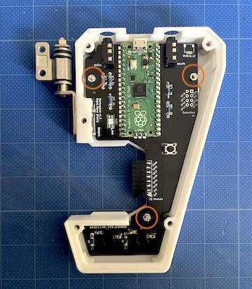
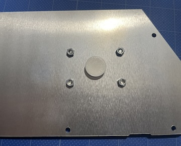
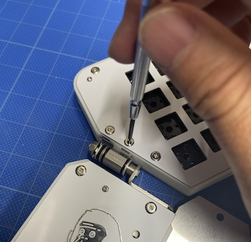
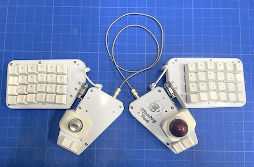

<!-- ### Monkeypad Build Guide Top Page is here [English](01_build_guide.md)  -->

  - [10.組み立て](10_組み立て.md)
    - [10-1. メインボードの組み立て](#10-1メインボードの組み立て)
    - [10-2. 三脚アダプタの取り付け](#10-2三脚アダプタの取り付け)
    - [10-3. サブボードの組み立て](#10-3サブボードの組み立て)
    - [10-4. ゴムパッドの貼り付け](#10-4ゴムパッドの貼り付け)

### 10-1.メインボードの組み立て

完全な左右対称でリバーシブルですのでトッププレートのアルミ面を面にするか、白&ロゴの面を表にするか決めてください。

※ アルミ面は表面塗装などを行なっていません。傷つきやすいので必要な場合は塗装してください。交換用に保守部品なども用意しています。

写真は白い面を表にする例で組み立てていきます。

[22]トルクヒンジをメインボディに固定します。[41]M３の六角ナットを反対側のナットポケットに挿入し、[38]M3低頭ネジ12mmで仮止めします。

写真のようにポケットに[36]六角両メネジを５個挿入していきます。[6]メイントッププレートを[37]M3低頭ネジ6mmで取り付けます。

写真のようにリブがある面をトッププレート側に取り付けます。トッププレートとメイン基板がリブを挟み込むよう固定します。

メイン基板を[39]M2ネジ8mmとナットで固定します。

[7]メインボトムプレートを(37)M3低頭ネジ6mmで固定します。

トルクヒンジは硬さが調整可能なヒンジです。六角ナットの締め具合で硬さが変わりますのでスパナで調整してください。強く締めすぎないでください。

### 10-2.三脚アダプタの取り付け

サブボードのボトムプレートにM3低頭ネジ6mmと[41]M3ナットで[46]三脚アダプタを取り付けます。
三脚アダプタの代わりに、[45]グロメットを取り付けることも可能です。お好きな方をお使いください。

三脚アダプタを取り付けた場合

グロメットを取り付けた場合

### 10-3.サブボードの組み立て

#### [サブボードにロープロファイルソケットを取り付ける場合はこちら](../low_profile/10_組み立て_ロープロ.md)

[11]サブボディと[8]サブトッププレートを固定します。サブボディのポケットに六角両メネジを５個挿入し、[37]M3低頭ネジ6mmでトッププレートを固定します。
写真のように取り付ける面はリブがついている面に取り付けます。

[2]サブボードのPCB基板を[39]M2ネジと[42]M2ナットで4箇所固定します。

このときPCB基板上のIOエキスパンダ、ジャック、コネクタの足はトッププレートに接触しないように余分な長さはカットしてあることを確認してください。

（接触して抵抗値が変わることにより不具合の原因となる場合があります。）

[9]サブボトムプレートをサブボディにM3低頭ネジ6mmで固定します。

最後にトルクヒンジを固定します。ナットポケットの下側にM3ナットを入れ、上から[38]M3低頭ネジ12mmで止めます。

写真のように90度動かしてもぶつからないようにトルクヒンジの位置や硬さを調整してください。

反対側も同様に組み立てます。

### 10-4.ゴムパッドの貼り付け

[44]クッションゴムを以下の位置に貼り付ければ組み立ては完成です。

お好みのキースイッチとキーキャップを取り付けてください。
お疲れ様でした！

  - [次へ(11_総仕上げ)](11_完成.md)