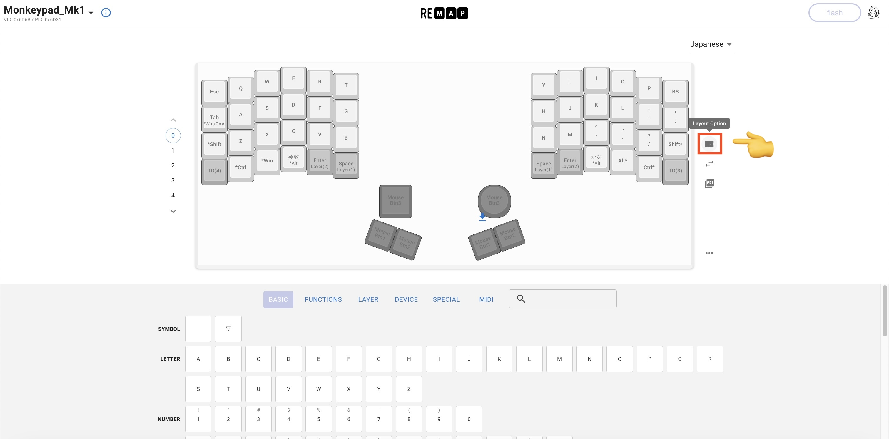
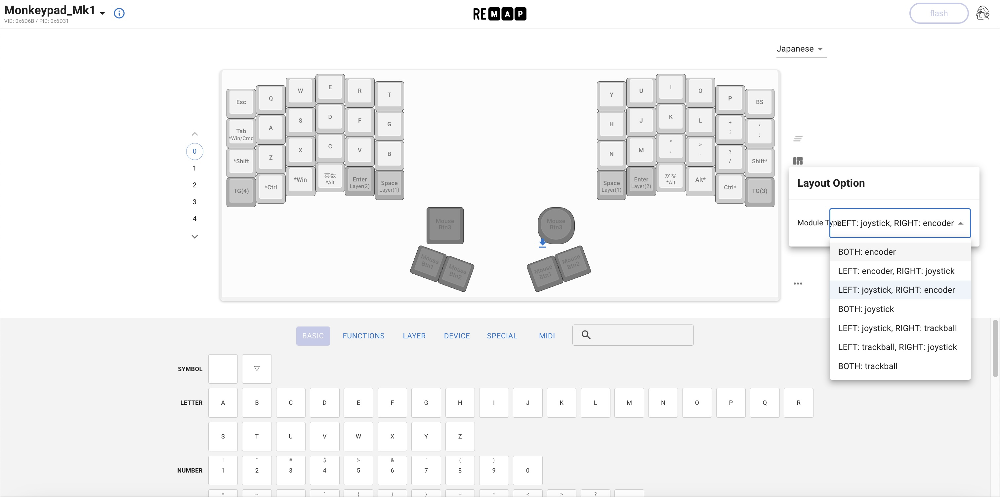
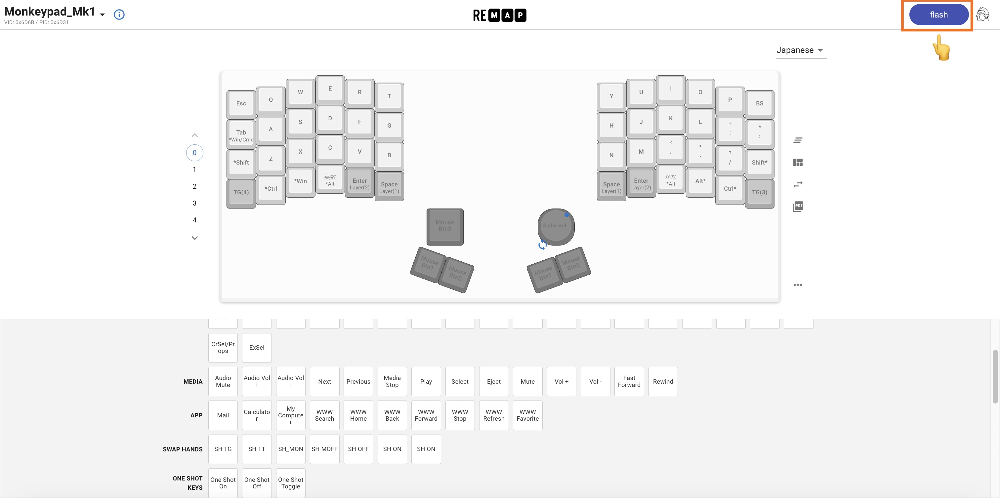

### Monkeypad Build Guide Top Page is here [English](01_build_guide.md)

  - [11. 総仕上げ！](11_ファームウェア.md)
    - [11-1. ファームウェアの書き込み](#11-1ファームウェアの書き込み)
    - [11-2. テスト](#11-2テスト)
    - [11-3. キーマップの変更(Remap)](#11-3キーマップの変更)
    - [11-4. より深くカスタマイズするには](#11-4より深くカスタマイズするには)

### 11-1.ファームウェアの書き込み

左右のモジュールをお好きな組み合わせで選び取り付けます。

※ モジュールをしっかりと動かないように固定したい場合は、M3タッピングネジで固定することもできますが、交換可能としておくためにネジ止めは不要です。

ファームウェアを書き込みます。

Remapを使用するために以下のVIA対応ファームウェアを書き込んでください。

9_1章でも記載したようにRaspberry Pi Picoは、PCB上に取り付けたResetボタン（タクトスイッチ）を素早く2回押すと、DFUモードで起動し、プログラムが書き込み可能となります。組み立て後は細い棒などで裏面のタクトスイッチを2回押してください。

**重要:** Monkeypadはユーザーがアプリケーションや用途に合わせてモジュールをいつでも交換可能です。
しかし、搭載されているモジュールをプログラム側で自動で認識して、切り替える機能はありません。
左右のモジュールに合わせて、以下のファイルをダウンロードし書き込みしてください。 

ファイル名は以下を意味しています。

{No}_{keyboard}_{model}_{left_module}_{right_module}_{LEFT HAND or RIGH HAND}_{keymap}.uf2

|No.|LEFT|RIGHT| *.uf2 |
|:----|:----|:----|:----|
|1|Trackball|Trackball|[1_mp_mk1_trackball_via.uf2](../build/1_mp_mk1_trackball_via.uf2)|
|2|Analog Joystick|Analog Joystick|[2_mp_mk1_joystick_via.uf2](../build/2_mp_mk1_joystick_via.uf2)|
|3|Encoder|Encoder|[3_mp_mk1_encoder_via.uf2](../build/3_mp_mk1_encoder_via.uf2)|
|4|Encoder|Trackball|[4_mp_mk1_left_encoder_right_trackball_via.uf2](../build/4_mp_mk1_left_encoder_right_trackball_via.uf2)|
|5|Encoder|Analog Joystick|[5_mp_mk1_left_encoder_right_joystick_via.uf2](../build/5_mp_mk1_left_encoder_right_joystick_via.uf2)|
|6|Trackball|Encoder|[6_mp_mk1_left_trackball_right_encoder_via.uf2](../build/6_mp_mk1_left_trackball_right_encoder_via.uf2)|
|7|Analog Joystick|Encoder|[7_mp_mk1_left_joystick_right_encoder_via.uf2](../build/7_mp_mk1_left_joystick_right_encoder_via.uf2)|

Different pointing devices for left and right

|No.|LEFT|RIGHT|left *.uf2|right *.uf2|
|:----|:----|:----|:----|:----|
|8|Analog Joystick|Trackball|[8_mp_mk1_left_joystick_right_trackball_LEFT_via.uf2](../build/8_mp_mk1_left_joystick_right_trackball_LEFT_via.uf2)|[8_mp_mk1_left_joystick_right_trackball_RIGHT_via.uf2](../build/8_mp_mk1_left_joystick_right_trackball_RIGHT_via.uf2)|
|9|Trackball|Analog Joystick|[9_mp_mk1_left_trackball_right_joystick_LEFT_via.uf2](../build/9_mp_mk1_left_trackball_right_joystick_LEFT_via.uf2)|[9_mp_mk1_left_trackball_right_joystick_RIGHT_via.uf2](../build/9_mp_mk1_left_trackball_right_joystick_RIGHT_via.uf2)|

### 11-2.テスト

お疲れ様でした。うまく動かない場合は、Q&Aを見ながらトラブルシュートしていきましょう。

すべての機能が動作すれば完成です。おめでとうございます！

### 11-3.キーマップの変更(Remap)

デフォルトのキーマップは以下からダウンロードできます。

[Default Keymap](../images/keymap_cheatsheet_monkeypad.pdf)

MonkeyPadは[Remap](https://salicylic-acid3.hatenablog.com/entry/remap-manual)に対応しています。VIAで変更する場合は「次章12_キーマップの変更_VIA」を参照してください。特別なソフトをインストールしなくてもファームウェアのカスタマイズとキーマップの変更が可能です。

Remapの使用方法については[自キ温泉ガイドのサリチル酸の記事](https://salicylic-acid3.hatenablog.com/entry/remap-manual)に詳しく解説されています。

Layout Optionを選択します。

取り付けたモジュールに合わせて、プルダウンから選択します。

キーマップをお好きな配置に変更後、flashボタンを押すと反映されます。

### 11-4.より深くカスタマイズするには

ご自身でファームウェアをビルドする場合

Monkeypadの最新ファームウェアはすべてGithubのリポジトリにて公開しています。ファームウェアからビルドする方法としては、以下の二通りがあります。

[Monkeypad(github)](https://github.com/monkeypad/monkeypad/tree/main/qmk_firmware/keyboards/monkeypad/monkeypad)

- Remap

Remapはキーマップの変更だけでなく、新機能としてファームウェアビルド機能が追加されました（2023/11）。ローカルにQMKの開発環境を構築することなく、ファームウェアをソースコードレベルからビルドすることもできます。詳しくは作者の[Yoichiroさんが解説されている記事](https://www.eisbahn.jp/yoichiro/2023/11/remap_building_firmware.html#gsc.tab=0)のユーザー向けの機能をご参照ください。

- QMK

monkeypadフォルダをお手持ちのQMK_Firmware/keyboardsへコピーして自由にキーマップ等を編集してビルドしてください。いろいろな方が解説されています。
