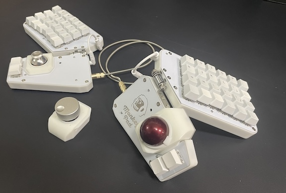
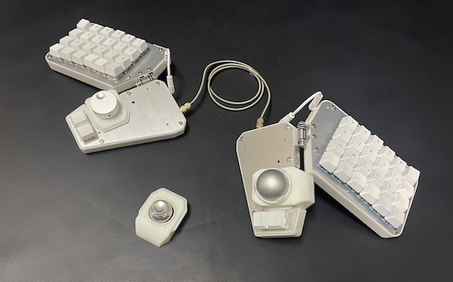
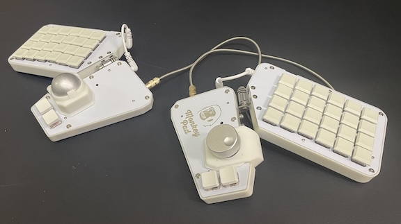
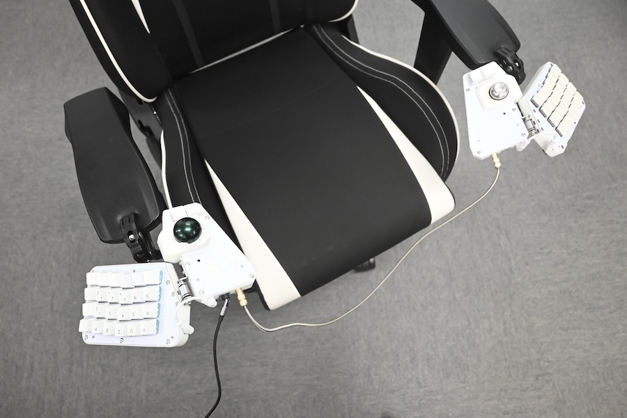
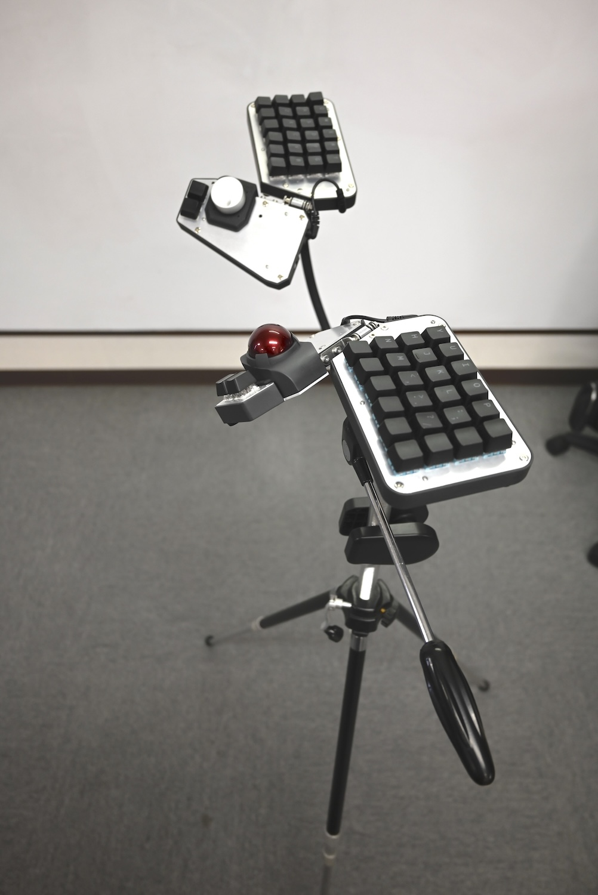

### Monkeypad Build Guide Top Page is here [English](01_build_guide.md)

### カスタマイズ

Monkeypadは作って完成ではなく、作ってからのカスタマイズが可能です。別売りのロープロファイルキースイッチ、キーソケットを搭載することで薄型のキーキャップを搭載することができます。

また、リバーシブルなトッププレートにより外観を変更することができます。

下面の三脚アダプタを取り付けると、以下のように市販品の三脚と組み合わせて様々な姿勢でタイプすることができます。

そのほかにサブボードにI2Cポート、PCB基板上に拡張ポートを搭載していますので自在にカスタマイズを楽しんでください！