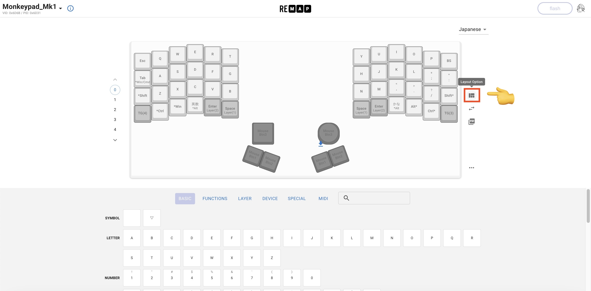
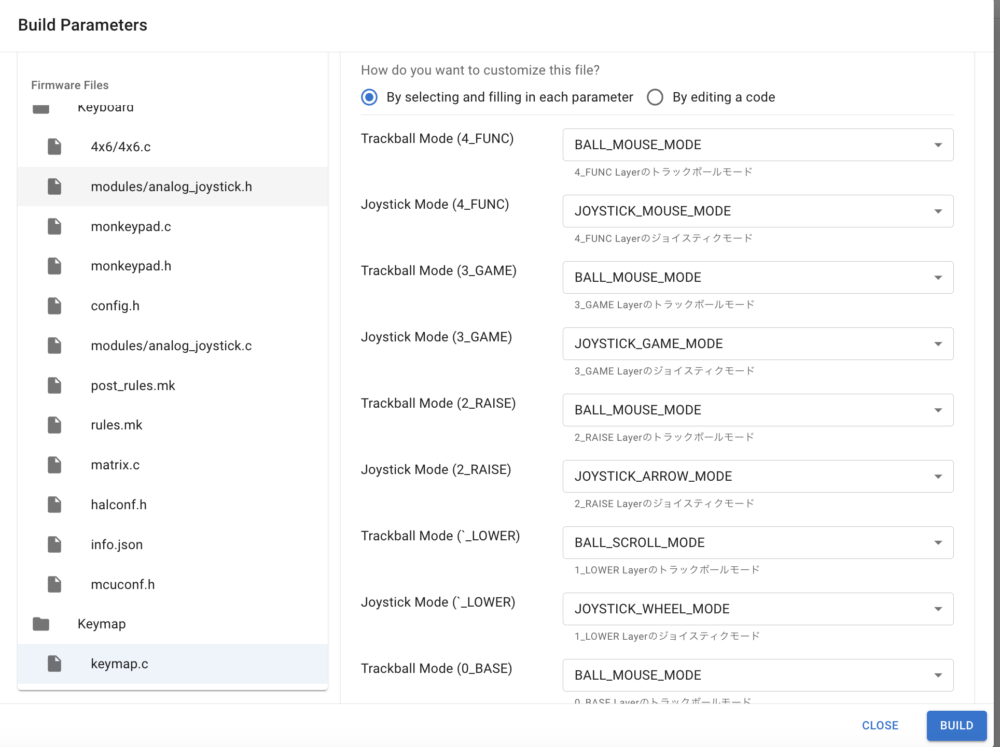

### Monkeypad Build Guide Top Page is here [English](01_build_guide.md)

  - [A01. キーマップの変更(Remap)](A01_キーマップの変更_Remap.md)
    - [A01-1. キーマップの変更(Remap)](#A01-1キーマップの変更)
    - [A01-2. より深くカスタマイズするには](#A01-2より深くカスタマイズするには)

### A01-1.キーマップの変更(Remap)

デフォルトのキーマップは以下からダウンロードできます。

[Default Keymap](../images/keymap_cheatsheet_monkeypad.pdf)

MonkeyPadは[Remap](https://salicylic-acid3.hatenablog.com/entry/remap-manual)に対応しています。特別なソフトをインストールしなくてもファームウェアのカスタマイズとキーマップの変更が可能です。VIAで変更する場合は次章[A02_キーマップの変更_VIA](A02_キーマップの変更_VIA.md)を参照してください。

Remapの使用方法については[自キ温泉ガイドのサリチル酸の記事](https://salicylic-acid3.hatenablog.com/entry/remap-manual)に詳しく解説されています。

Layout Optionを選択します。

取り付けたモジュールに合わせて、プルダウンから選択します。

キーマップをお好きな配置に変更後、flashボタンを押すと反映されます。

### A01-2.より深くカスタマイズするには

ご自身でファームウェアをビルドする場合

Monkeypadの最新ファームウェアはすべてGithubのリポジトリにて公開しています。ファームウェアからビルドする方法としては、以下の二通りがあります。

[Monkeypad(github)](https://github.com/monkeypad/monkeypad/tree/main/qmk_firmware/keyboards/monkeypad/monkeypad)

（方法１）Remap

Remapはキーマップの変更だけでなく、新機能としてファームウェアビルド機能が追加されました（2023/11）。ローカルにQMKの開発環境を構築することなく、ファームウェアをソースコードレベルからビルドすることもできます。詳しくは作者の[Yoichiroさんが解説されている記事](https://www.eisbahn.jp/yoichiro/2023/11/remap_building_firmware.html#gsc.tab=0)のユーザー向けの機能をご参照ください。

Remapのトップページから[FIND A KEYBOARD]を選択し、検索画面より[Monkeypad_Mk1]を検索して下さい。

BUILDタブを選択し、[BUILD FIRMWARE]ボタンを押します。

Build Parametersの画面が開きます。

**重要:** 

Monkeypadは異なるアプリケーションや用途のために複数のモジュールを交換可能となっています。

しかし、QMK (version: 0.23.0)は現在、複数の異なるポインティングデバイス・センサータイプを標準でサポートしていません。

左右で異なるポインティングデバイス（analog_joystick / pmw3389）を使用する場合は、左右それぞれに別々のファームウェアが必要となり、ターゲットとなるポインティングデバイスを指定して2回ビルドする必要があります。エンコーダーを使用する場合や、左右同じ種類のポインティングデバイス（eg.左右両方トラックボール）を使用する場合はファームウェアは左右共通のファームウェアが使用可能です。

ファームウェアをビルドする前に `rules.mk` でモジュールを指定していることを確認してください。

`keymap.c` でトラックボール、アナログジョイスティックのモードを変更することができます。

| Trackball Mode | Description                                                 |
| -------------- | ----------------------------------------------------------- |
| BALL_MOUSE_MODE | マウスのようにカーソルを移動する. |
| BALL_SCROLL_MODE | 画面をスクロールする。 |

| Joystick Mode  | Description                                                 |
| -------------- | ----------------------------------------------------------- |
| JOYSTICK_MOUSE_MODE | マウスのようにカーソルを移動する. |
| JOYSTICK_WHEEL_MODE | マウスホイールのキーコードを送る。Wheel Up (KC_WH_U), Down (KC_WH_D), Left (KC_WH_L), Right (KC_WH_R) |
| JOYSTICK_ARROW_MODE | 上下左右矢印のキーコードを送る。 Up (KC_UP), Down (KC_DOWN), Left (KC_LEFT), and Right (KC_RIGHT) |
| JOYSTICK_GAME_MODE | WASD（ゲームで移動に使われるキー）のキーコードを送る。 W (KC_W), A (KC_A), S (KC_S), and D (KC_D) |
| JOYSTICK_CUSTOM_MODE | ユーザーが、analog_joystick.cで定義するキーコードを送る。|

さらに`config.h` でトラックボールのスクロールモード、アナログジョイスティックのホイールモードの向きを逆転させることができます。

さらに`modules/analog_joystick.c` でアナログジョイスティックのカスタムモード時のキーコードを設定することができます。デフォルト設定は[1,2,3,4]としています。

変更箇所の設定を行い、BUILDボタンを押すと、ファームウェアがビルドされます。ダウンロードして書き込みして下さい。

（方法２）QMK

githubのmonkeypadフォルダをお手持ちのQMK_Firmware/keyboardsへコピーして自由にキーマップ等を編集してビルドしてください。詳しくはディレクトリ内にあるreadmeをお読み下さい。

