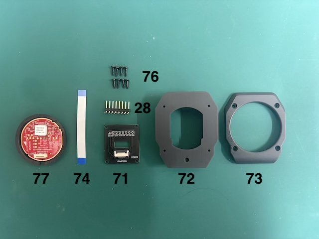
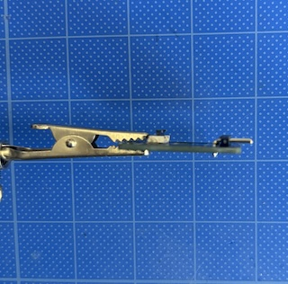
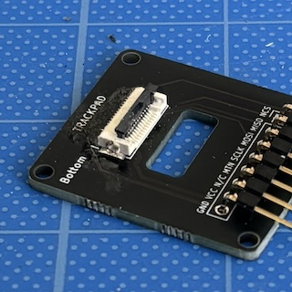
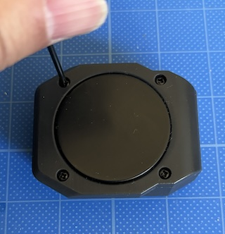
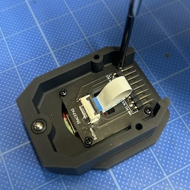
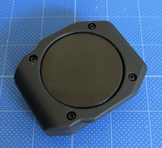

<!-- ### Monkeypad Build Guide Top Page is here [English](01_build_guide.md)  -->

  - [B. トラックパッドモジュールの組み立て](B01_トラックパッド_TM035035.md)
    - [B-1. 使用する部品](./B01_トラックパッド_TM035035.md/#B-1使用する部品)
    - [B-2. PMW3389部品のはんだ付け](./B01_トラックパッド_TM035035.md/#B-2部品のはんだ付け)
    - [B-3. トラックボールモジュールの組み立て](./B01_トラックパッド_TM035035.md/#B-3トラックパッドモジュールの組み立て)  

### B-1．使用する部品

追加オプションのトラックパッドモジュールの組み立てです。
Cirque社製のトラックパッドモジュール(TM035035-2024-003)を使用します。SPI通信（12ピン）をMonkeypadのモジュールと接続するために変換基板を経由し接続します。

| No | 名前 | 数 | 備考 |
|:-|:-|:-|:-|
| 71 | トラックパッド変換基板 | 1個 ||
| 72 | トラックパッドカバー(下) | 1個 ||
| 73 | トラックパッドカバー(上) | 1個 ||
| 74 | FFC/FPCフラットケーブル | 1個 ||
| 28 | ピンヘッダ8ピンL型 | 1個 ||
| 76 | タッピングネジ M2 x 6mm | 8個 ||
| 77 | トラックパッド(TM035035-2024-003) | 1個 ||

### B-2．PMW3389部品のはんだ付け

トラックパッド部品のはんだ付けは[28]ピンヘッダ8ピンL型をはんだ付けします。

***重要***
写真を見て、向きに注意してください。

「BOTTOM」側に[28]8ピンL型のピンヘッダを固定し、水平に取り付くように裏面をハンダづけします。

 

  

### B-3. トラックパッドモジュールの組み立て

[74]コネクタ部の爪を起こし、FFC/FPCフラットケーブルを青い面が上、ピンが下にくるように接続します。

  

  

[73]次に、トラックパッドカバー(上) に[77]トラックパッド(TM035035-2024-003)をはめます。図のように切り欠き部が揃うようにトラックパッドをはめてください。

  

トラックパッドをマスキングテープで止めておくと、部品のカタつきが抑えられます。
  

トラックパッドと[73]トラックパッドカバー(上)を[72]トラックパッドカバー(下)にピンの位置を合わせてかぶせます。

  

[76]M2タッピングネジでトラックボールカバーを固定します。

  

ケーブルをトラックパッドに接続します。向きに注意してください。

  

M2タッピングネジで変換基板を固定します。

  

トラックパッドモジュールの完成です。

  
