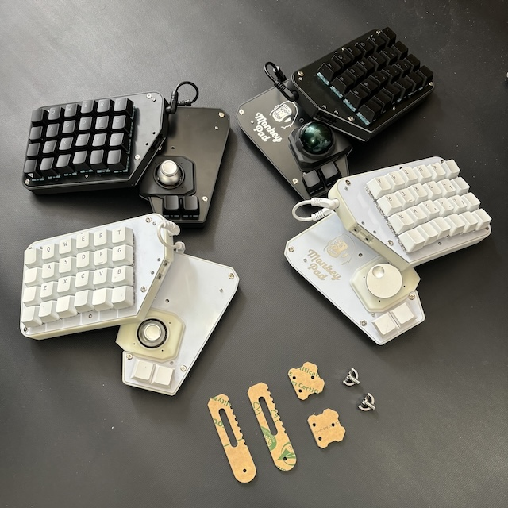
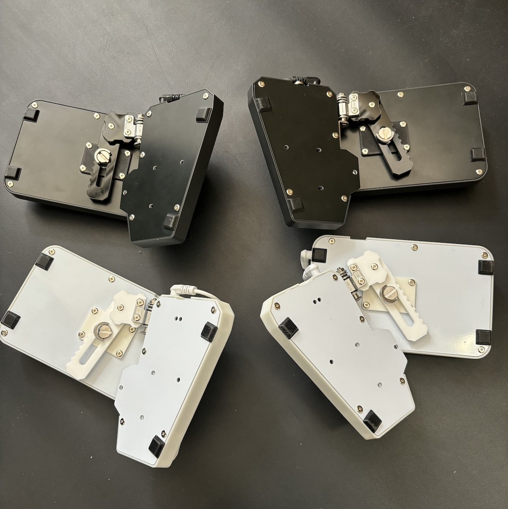
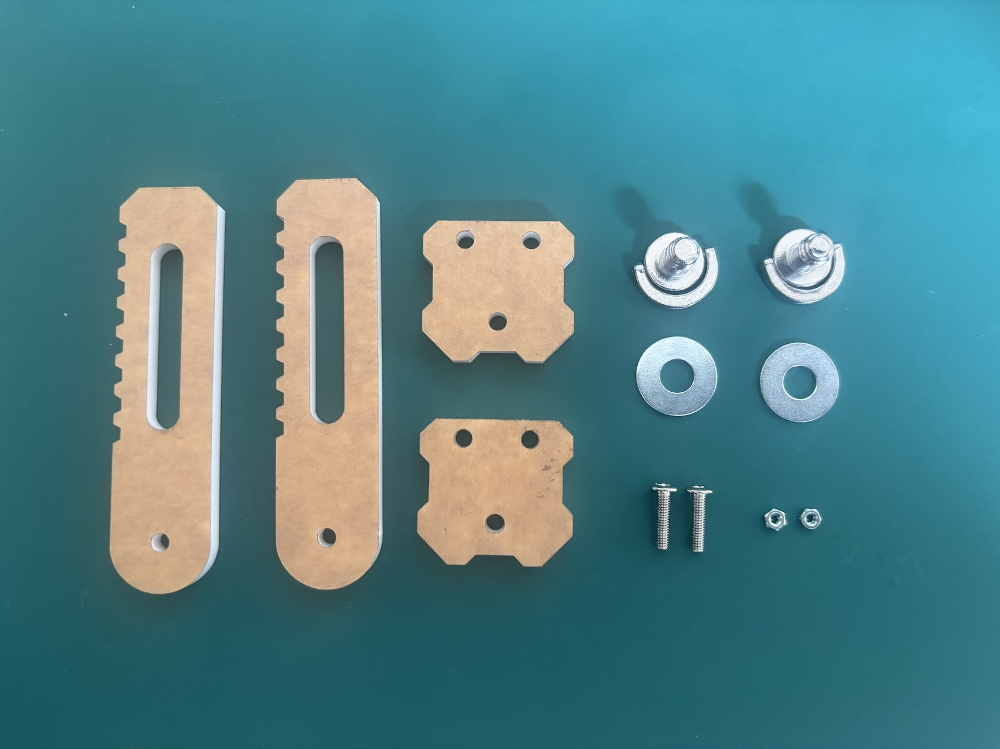
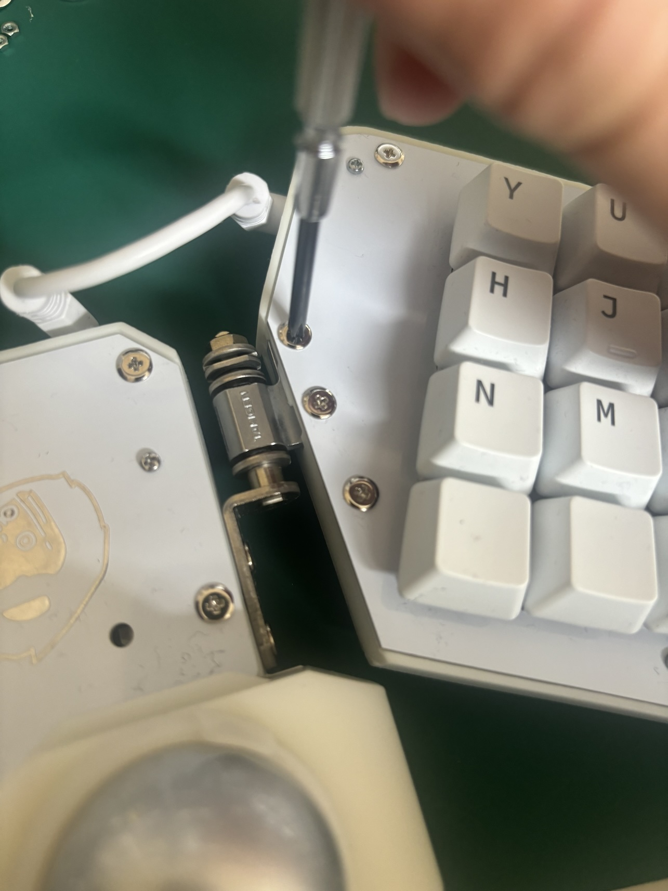
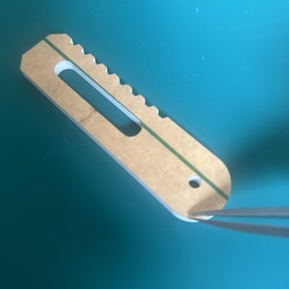
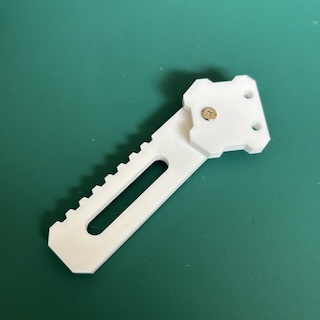
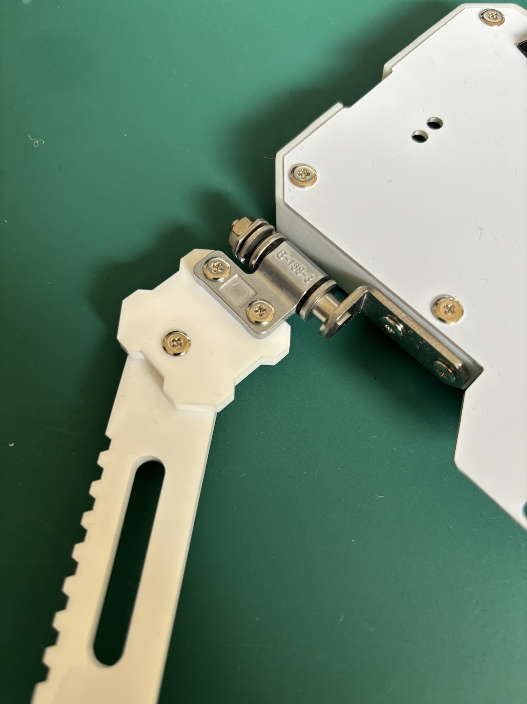
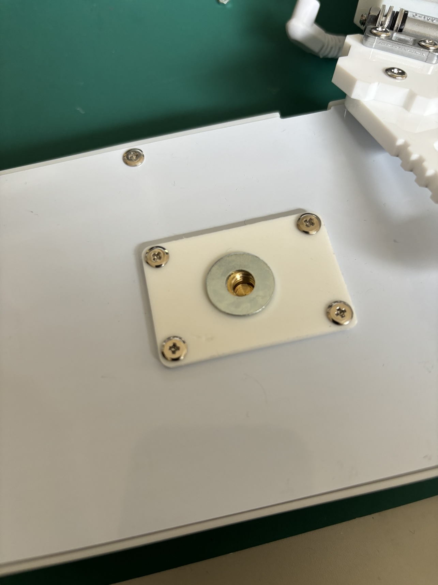
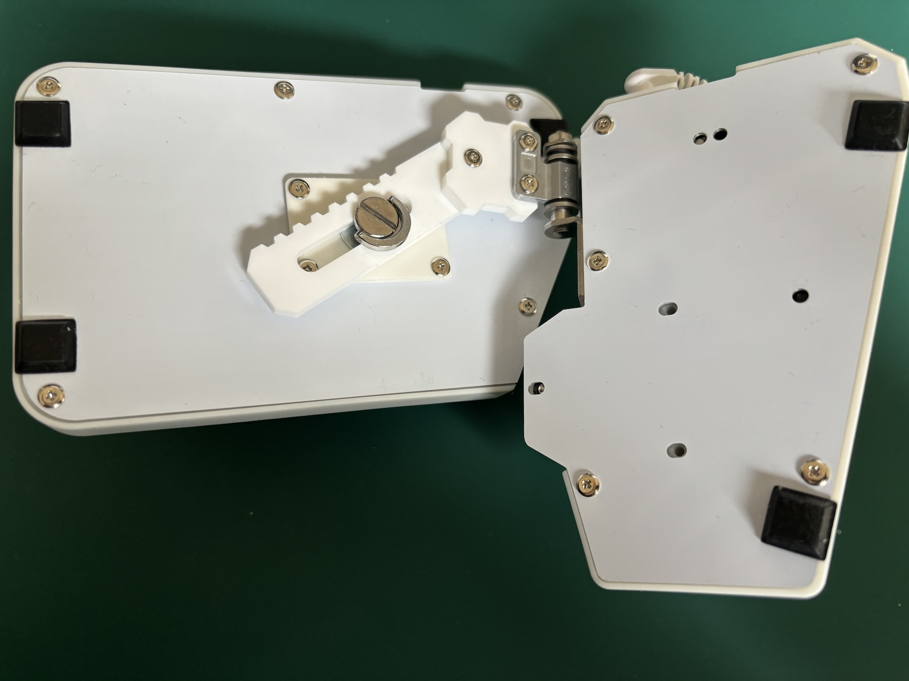
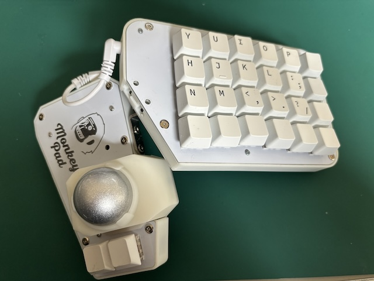

<!-- ### Monkeypad Build Guide Top Page is here [English](01_build_guide.md)  -->

  - [B. アジャスタブルリンクの組み立て](B02_アジャスタブルリンク.md)
    - [B-1. 使用する部品](./B02_アジャスタブルリンク.md/#B-1使用する部品)
    - [B-2. アジャスタブルリンクの組み立て](./B02_アジャスタブルリンク.md/#B-2アジャスタブルリンクの組み立て)  

### B-1．使用する部品

追加オプションのアジャスタブルリンクの組み立てです。

| No | 名前 | 数 | 備考 |
|:-|:-|:-|:-|
| 81 | 1/4インチネジ | 2個 ||
| 82 | リンク(short) | 2個 ||
| 83 | リンク(long) | 2個 ||
| 84 | ワッシャー | 2個 ||
| 38 | 低頭ネジ M3 x 12mm | 2個 ||
| 41 | 六角ナット M3 | 2個 ||

### B-2．アジャスタブルリンクの組み立て

トルクヒンジのM3ネジを図のように二つ取り外します。外したネジとナットは使用しますので無くさないように注意してください。

アクリルの表面の保護シートを外します。

 

[82]リンク(short)と[83]リンク(long)を[38]M3低頭ネジと[41]M3ナットで固定します。

  

[82]リンク(short)とトルクヒンジを[38]M3低頭ネジと[41]M3ナットで固定します。

  

[84]ワッシャを入れます。

  

重ねる方向を図を見ながら注意してください。

  

お好きな位置、角度に調整品がしながら1/4インチネジで固定し、完成です。反対側も同様に組み立てます。

  
